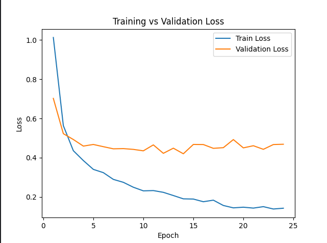

**MemeSense**

MemeSense is a multimodal AI system that automatically classifies memes into categories using 
both **image content** and **text extracted from the meme**.

The model combines computer vision and natural language processing
to understand memes more accurately.

## Features

- Upload a meme image through a web interface
- Automatic text extraction using OCR
- Multimodal neural network combining image and text features
- Meme classification into categories
- Confidence score for predictions
- Simple web interface built with Flask

## Model Architecture

The system uses a multimodal deep learning model:

- Image encoder: CNN (ResNet-based feature extractor)
- Text encoder: DistilBERT
- Fusion layer: combines image and text embeddings
- Classifier: predicts meme category

Pipeline:

1. User uploads a meme
2. OCR extracts text from the image
3. Image → CNN encoder
4. Text → DistilBERT encoder
5. Features are fused in a multimodal model
6. The model predicts the meme category

## Meme Categories

The model classifies memes into the following categories:

- "animal_meme"
- "dark_humor_meme"
- "reaction_meme"
- "screenshot_meme"
- "text_meme"

## Web Interface

The web interface allows users to:

- Upload a meme image
- Run AI classification
- See prediction results and confidence score

Built with:

- Python
- Flask
- HTML + CSS

##  Technologies Used

- Python
- PyTorch
- Transformers (HuggingFace)
- DistilBERT
- OpenCV / PIL
- Tesseract OCR
- Flask
- HTML / CSS

## Installation
⚠️ Important: Large Files (Git LFS)
This project uses Git LFS to store model weights (.pt and .pth files).
Before cloning, ensure you have Git LFS installed:

Download and install Git LFS.

Run git lfs install in your terminal.

--- Clone the repository

git clone https://github.com/yourusername/MemeSense.git
cd MemeSense
**Ensure large files are downloaded**
git lfs pull

--- Create a virtual environment

python -m venv venv
Activate it:

Windows:
venv\Scripts\activate

Mac/Linux:

source venv/bin/activate

---Install dependencies

pip install -r requirements.txt

---Install Tesseract OCR

Download Tesseract and install it.
Then set the path in the code:

pytesseract.pytesseract.tesseract_cmd = r"PATH_TO_TESSERACT\tesseract.exe"

--- Running the Application

Start the Flask server:

python app.py

Then open in your browser:

http://127.0.0.1:5000

## Interface

**Main Page**

.png)

**Result Page**

**Training vs Validation loss**

**Validation accuracy**

## 📁 Project Structure
MemeSense
├───.idea
│   └───inspectionProfiles
├───data
│   ├───test
│   │   ├───animal_meme
│   │   ├───dark_humor_meme
│   │   ├───reaction_meme
│   │   ├───screenshot_meme
│   │   └───text_meme
│   ├───train
│   │   ├───animal_meme
│   │   ├───dark_humor_meme
│   │   ├───reaction_meme
│   │   ├───screenshot_meme
│   │   └───text_meme
│   └───val
│       ├───animal_meme
│       ├───dark_humor_meme
│       ├───reaction_meme
│       ├───screenshot_meme
│       └───text_meme
├───ml
│   ├───fusion
│   │   └───__pycache__
│   ├───image
│   ├───preprocessing
│   ├───temporary
│   ├───text
│   │   └───__pycache__
│   └───__pycache__
├───screenshots
├───static
├───templates
└───venv
    ├───Lib
    │   └───site-packages
    │       ├───annotated_doc
    │       │   └───__pycache__
    │       ├───annotated_doc-0.0.4.dist-info
    │       │   └───licenses
    │       ├───anyio
    │       │   ├───abc
    │       │   │   └───__pycache__
    │       │   ├───streams
    │       │   │   └───__pycache__
    │       │   ├───_backends
    │       │   │   └───__pycache__
    │       │   ├───_core
    │       │   │   └───__pycache__
    │       │   └───__pycache__
    │       ├───anyio-4.12.1.dist-info
    │       │   └───licenses
    │       ├───bidi
    │       │   └───__pycache__
    │       ├───blinker
    │       │   └───__pycache__
    │       ├───blinker-1.9.0.dist-info
    │       ├───certifi
    │       │   └───__pycache__
    │       ├───certifi-2026.2.25.dist-info
    │       │   └───licenses
    │       ├───click
    │       │   └───__pycache__
    │       ├───click-8.3.1.dist-info
    │       │   └───licenses
    │       ├───colorama
    │       │   ├───tests
    │       │   │   └───__pycache__
    │       │   └───__pycache__
    │       ├───colorama-0.4.6.dist-info
    │       │   └───licenses
    │       ├───contourpy
    │       │   ├───util
    │       │   │   └───__pycache__
    │       │   └───__pycache__
    │       ├───contourpy-1.3.3.dist-info
    │       ├───cv2
    │       │   ├───aruco
    │       │   ├───barcode
    │       │   ├───cuda
    │       │   ├───data
    │       │   │   └───__pycache__
    │       │   ├───detail
    │       │   ├───dnn
    │       │   ├───Error
    │       │   ├───fisheye
    │       │   ├───flann
    │       │   ├───gapi
    │       │   │   ├───core
    │       │   │   │   ├───cpu
    │       │   │   │   ├───fluid
    │       │   │   │   └───ocl
    │       │   │   ├───ie
    │       │   │   │   └───detail
    │       │   │   ├───imgproc
    │       │   │   │   └───fluid
    │       │   │   ├───oak
    │       │   │   ├───onnx
    │       │   │   │   └───ep
    │       │   │   ├───ot
    │       │   │   │   └───cpu
    │       │   │   ├───ov
    │       │   │   ├───own
    │       │   │   │   └───detail
    │       │   │   ├───render
    │       │   │   │   └───ocv
    │       │   │   ├───streaming
    │       │   │   ├───video
    │       │   │   ├───wip
    │       │   │   │   ├───draw
    │       │   │   │   ├───gst
    │       │   │   │   └───onevpl
    │       │   │   └───__pycache__
    │       │   ├───instr
    │       │   ├───ipp
    │       │   ├───mat_wrapper
    │       │   │   └───__pycache__
    │       │   ├───misc
    │       │   │   └───__pycache__
    │       │   ├───ml
    │       │   ├───ocl
    │       │   ├───ogl
    │       │   ├───parallel
    │       │   ├───samples
    │       │   ├───segmentation
    │       │   ├───typing
    │       │   │   └───__pycache__
    │       │   ├───utils
    │       │   │   ├───fs
    │       │   │   ├───logging
    │       │   │   ├───nested
    │       │   │   └───__pycache__
    │       │   ├───videoio_registry
    │       │   └───__pycache__
    │       ├───cycler
    │       │   └───__pycache__
    │       ├───cycler-0.12.1.dist-info
    │       ├───dateutil
    │       │   ├───parser
    │       │   │   └───__pycache__
    │       │   ├───tz
    │       │   │   └───__pycache__
    │       │   ├───zoneinfo
    │       │   │   └───__pycache__
    │       │   └───__pycache__
    │       ├───easyocr
    │       │   ├───character
    │       │   ├───DBNet
    │       │   │   ├───assets
    │       │   │   │   └───ops
    │       │   │   │       └───dcn
    │       │   │   │           ├───functions
    │       │   │   │           │   └───__pycache__
    │       │   │   │           ├───modules
    │       │   │   │           │   └───__pycache__
    │       │   │   │           ├───src
    │       │   │   │           └───__pycache__
    │       │   │   ├───backbones
    │       │   │   │   └───__pycache__
    │       │   │   ├───configs
    │       │   │   ├───decoders
    │       │   │   │   └───__pycache__
    │       │   │   ├───model
    │       │   │   │   └───__pycache__
    │       │   │   └───__pycache__
    │       │   ├───model
    │       │   │   └───__pycache__
    │       │   ├───scripts
    │       │   │   └───__pycache__
    │       │   └───__pycache__
    │       ├───easyocr-1.7.2.dist-info
    │       ├───filelock
    │       │   └───__pycache__
    │       ├───filelock-3.20.3.dist-info
    │       │   └───licenses
    │       ├───flask
    │       │   ├───json
    │       │   │   └───__pycache__
    │       │   ├───sansio
    │       │   │   └───__pycache__
    │       │   └───__pycache__
    │       ├───flask-3.1.3.dist-info
    │       │   └───licenses
    │       ├───fontTools
    │       │   ├───cffLib
    │       │   │   └───__pycache__
    │       │   ├───colorLib
    │       │   │   └───__pycache__
    │       │   ├───config
    │       │   │   └───__pycache__
    │       │   ├───cu2qu
    │       │   │   └───__pycache__
    │       │   ├───designspaceLib
    │       │   │   └───__pycache__
    │       │   ├───encodings
    │       │   │   └───__pycache__
    │       │   ├───feaLib
    │       │   │   └───__pycache__
    │       │   ├───merge
    │       │   │   └───__pycache__
    │       │   ├───misc
    │       │   │   ├───filesystem
    │       │   │   │   └───__pycache__
    │       │   │   ├───plistlib
    │       │   │   │   └───__pycache__
    │       │   │   └───__pycache__
    │       │   ├───mtiLib
    │       │   │   └───__pycache__
    │       │   ├───otlLib
    │       │   │   ├───optimize
    │       │   │   │   └───__pycache__
    │       │   │   └───__pycache__
    │       │   ├───pens
    │       │   │   └───__pycache__
    │       │   ├───qu2cu
    │       │   │   └───__pycache__
    │       │   ├───subset
    │       │   │   └───__pycache__
    │       │   ├───svgLib
    │       │   │   ├───path
    │       │   │   │   └───__pycache__
    │       │   │   └───__pycache__
    │       │   ├───t1Lib
    │       │   │   └───__pycache__
    │       │   ├───ttLib
    │       │   │   ├───tables
    │       │   │   │   └───__pycache__
    │       │   │   └───__pycache__
    │       │   ├───ufoLib
    │       │   │   └───__pycache__
    │       │   ├───unicodedata
    │       │   │   └───__pycache__
    │       │   ├───varLib
    │       │   │   ├───avar
    │       │   │   │   └───__pycache__
    │       │   │   ├───instancer
    │       │   │   │   └───__pycache__
    │       │   │   └───__pycache__
    │       │   ├───voltLib
    │       │   │   └───__pycache__
    │       │   └───__pycache__
    │       ├───fonttools-4.61.1.dist-info
    │       │   └───licenses
    │       ├───fsspec
    │       │   ├───implementations
    │       │   │   └───__pycache__
    │       │   ├───tests
    │       │   │   └───abstract
    │       │   │       └───__pycache__
    │       │   └───__pycache__
    │       ├───fsspec-2026.2.0.dist-info
    │       │   └───licenses
    │       ├───functorch
    │       │   ├───compile
    │       │   │   └───__pycache__
    │       │   ├───dim
    │       │   │   └───__pycache__
    │       │   ├───einops
    │       │   │   └───__pycache__
    │       │   ├───experimental
    │       │   │   └───__pycache__
    │       │   ├───_src
    │       │   │   ├───aot_autograd
    │       │   │   │   └───__pycache__
    │       │   │   ├───eager_transforms
    │       │   │   │   └───__pycache__
    │       │   │   ├───make_functional
    │       │   │   │   └───__pycache__
    │       │   │   ├───vmap
    │       │   │   │   └───__pycache__
    │       │   │   └───__pycache__
    │       │   └───__pycache__
    │       ├───h11
    │       │   └───__pycache__
    │       ├───h11-0.16.0.dist-info
    │       │   └───licenses
    │       ├───hf_xet
    │       │   └───__pycache__
    │       ├───hf_xet-1.3.2.dist-info
    │       │   ├───licenses
    │       │   └───sboms
    │       ├───httpcore
    │       │   ├───_async
    │       │   │   └───__pycache__
    │       │   ├───_backends
    │       │   │   └───__pycache__
    │       │   ├───_sync
    │       │   │   └───__pycache__
    │       │   └───__pycache__
    │       ├───httpcore-1.0.9.dist-info
    │       │   └───licenses
    │       ├───httpx
    │       │   ├───_transports
    │       │   │   └───__pycache__
    │       │   └───__pycache__
    │       ├───httpx-0.28.1.dist-info
    │       │   └───licenses
    │       ├───huggingface_hub
    │       │   ├───cli
    │       │   │   └───__pycache__
    │       │   ├───inference
    │       │   │   ├───_generated
    │       │   │   │   ├───types
    │       │   │   │   │   └───__pycache__
    │       │   │   │   └───__pycache__
    │       │   │   ├───_mcp
    │       │   │   │   └───__pycache__
    │       │   │   ├───_providers
    │       │   │   │   └───__pycache__
    │       │   │   └───__pycache__
    │       │   ├───serialization
    │       │   │   └───__pycache__
    │       │   ├───templates
    │       │   ├───utils
    │       │   │   └───__pycache__
    │       │   ├───_hot_reload
    │       │   │   └───__pycache__
    │       │   └───__pycache__
    │       ├───huggingface_hub-1.5.0.dist-info
    │       │   └───licenses
    │       ├───idna
    │       │   └───__pycache__
    │       ├───idna-3.11.dist-info
    │       │   └───licenses
    │       ├───imageio
    │       │   ├───config
    │       │   │   └───__pycache__
    │       │   ├───core
    │       │   │   └───__pycache__
    │       │   ├───plugins
    │       │   │   └───__pycache__
    │       │   └───__pycache__
    │       ├───imageio-2.37.2.dist-info
    │       │   └───licenses
    │       ├───itsdangerous
    │       │   └───__pycache__
    │       ├───itsdangerous-2.2.0.dist-info
    │       ├───jinja2
    │       │   └───__pycache__
    │       ├───jinja2-3.1.6.dist-info
    │       │   └───licenses
    │       ├───joblib
    │       │   ├───externals
    │       │   │   ├───cloudpickle
    │       │   │   │   └───__pycache__
    │       │   │   ├───loky
    │       │   │   │   ├───backend
    │       │   │   │   │   └───__pycache__
    │       │   │   │   └───__pycache__
    │       │   │   └───__pycache__
    │       │   ├───test
    │       │   │   ├───data
    │       │   │   │   └───__pycache__
    │       │   │   └───__pycache__
    │       │   └───__pycache__
    │       ├───joblib-1.5.3.dist-info
    │       │   └───licenses
    │       ├───kiwisolver
    │       │   └───__pycache__
    │       ├───kiwisolver-1.4.9.dist-info
    │       │   └───licenses
    │       ├───lazy_loader
    │       │   ├───tests
    │       │   │   ├───fake_pkg
    │       │   │   │   └───__pycache__
    │       │   │   └───__pycache__
    │       │   └───__pycache__
    │       ├───lazy_loader-0.4.dist-info
    │       ├───markdown_it
    │       │   ├───cli
    │       │   │   └───__pycache__
    │       │   ├───common
    │       │   │   └───__pycache__
    │       │   ├───helpers
    │       │   │   └───__pycache__
    │       │   ├───presets
    │       │   │   └───__pycache__
    │       │   ├───rules_block
    │       │   │   └───__pycache__
    │       │   ├───rules_core
    │       │   │   └───__pycache__
    │       │   ├───rules_inline
    │       │   │   └───__pycache__
    │       │   └───__pycache__
    │       ├───markdown_it_py-4.0.0.dist-info
    │       │   └───licenses
    │       ├───markupsafe
    │       │   └───__pycache__
    │       ├───markupsafe-3.0.3.dist-info
    │       │   └───licenses
    │       ├───matplotlib
    │       │   ├───axes
    │       │   │   └───__pycache__
    │       │   ├───backends
    │       │   │   ├───qt_editor
    │       │   │   │   └───__pycache__
    │       │   │   ├───web_backend
    │       │   │   │   ├───css
    │       │   │   │   └───js
    │       │   │   └───__pycache__
    │       │   ├───mpl-data
    │       │   │   ├───fonts
    │       │   │   │   ├───afm
    │       │   │   │   ├───pdfcorefonts
    │       │   │   │   └───ttf
    │       │   │   ├───images
    │       │   │   ├───plot_directive
    │       │   │   ├───sample_data
    │       │   │   │   └───axes_grid
    │       │   │   └───stylelib
    │       │   ├───projections
    │       │   │   └───__pycache__
    │       │   ├───sphinxext
    │       │   │   └───__pycache__
    │       │   ├───style
    │       │   │   └───__pycache__
    │       │   ├───testing
    │       │   │   ├───jpl_units
    │       │   │   │   └───__pycache__
    │       │   │   └───__pycache__
    │       │   ├───tests
    │       │   │   └───__pycache__
    │       │   ├───tri
    │       │   │   └───__pycache__
    │       │   ├───_api
    │       │   │   └───__pycache__
    │       │   └───__pycache__
    │       ├───matplotlib-3.10.8.dist-info
    │       ├───mdurl
    │       │   └───__pycache__
    │       ├───mdurl-0.1.2.dist-info
    │       ├───mpl_toolkits
    │       │   ├───axes_grid1
    │       │   │   ├───tests
    │       │   │   │   └───__pycache__
    │       │   │   └───__pycache__
    │       │   ├───axisartist
    │       │   │   ├───tests
    │       │   │   │   └───__pycache__
    │       │   │   └───__pycache__
    │       │   └───mplot3d
    │       │       ├───tests
    │       │       │   └───__pycache__
    │       │       └───__pycache__
    │       ├───mpmath
    │       │   ├───calculus
    │       │   │   └───__pycache__
    │       │   ├───functions
    │       │   │   └───__pycache__
    │       │   ├───libmp
    │       │   │   └───__pycache__
    │       │   ├───matrices
    │       │   │   └───__pycache__
    │       │   ├───tests
    │       │   │   └───__pycache__
    │       │   └───__pycache__
    │       ├───mpmath-1.3.0.dist-info
    │       ├───networkx
    │       │   ├───algorithms
    │       │   │   ├───approximation
    │       │   │   │   ├───tests
    │       │   │   │   │   └───__pycache__
    │       │   │   │   └───__pycache__
    │       │   │   ├───assortativity
    │       │   │   │   ├───tests
    │       │   │   │   │   └───__pycache__
    │       │   │   │   └───__pycache__
    │       │   │   ├───bipartite
    │       │   │   │   ├───tests
    │       │   │   │   │   └───__pycache__
    │       │   │   │   └───__pycache__
    │       │   │   ├───centrality
    │       │   │   │   ├───tests
    │       │   │   │   │   └───__pycache__
    │       │   │   │   └───__pycache__
    │       │   │   ├───coloring
    │       │   │   │   ├───tests
    │       │   │   │   │   └───__pycache__
    │       │   │   │   └───__pycache__
    │       │   │   ├───community
    │       │   │   │   ├───tests
    │       │   │   │   │   └───__pycache__
    │       │   │   │   └───__pycache__
    │       │   │   ├───components
    │       │   │   │   ├───tests
    │       │   │   │   │   └───__pycache__
    │       │   │   │   └───__pycache__
    │       │   │   ├───connectivity
    │       │   │   │   ├───tests
    │       │   │   │   │   └───__pycache__
    │       │   │   │   └───__pycache__
    │       │   │   ├───flow
    │       │   │   │   ├───tests
    │       │   │   │   │   └───__pycache__
    │       │   │   │   └───__pycache__
    │       │   │   ├───isomorphism
    │       │   │   │   ├───tests
    │       │   │   │   │   └───__pycache__
    │       │   │   │   └───__pycache__
    │       │   │   ├───link_analysis
    │       │   │   │   ├───tests
    │       │   │   │   │   └───__pycache__
    │       │   │   │   └───__pycache__
    │       │   │   ├───minors
    │       │   │   │   ├───tests
    │       │   │   │   │   └───__pycache__
    │       │   │   │   └───__pycache__
    │       │   │   ├───operators
    │       │   │   │   ├───tests
    │       │   │   │   │   └───__pycache__
    │       │   │   │   └───__pycache__
    │       │   │   ├───shortest_paths
    │       │   │   │   ├───tests
    │       │   │   │   │   └───__pycache__
    │       │   │   │   └───__pycache__
    │       │   │   ├───tests
    │       │   │   │   └───__pycache__
    │       │   │   ├───traversal
    │       │   │   │   ├───tests
    │       │   │   │   │   └───__pycache__
    │       │   │   │   └───__pycache__
    │       │   │   ├───tree
    │       │   │   │   ├───tests
    │       │   │   │   │   └───__pycache__
    │       │   │   │   └───__pycache__
    │       │   │   └───__pycache__
    │       │   ├───classes
    │       │   │   ├───tests
    │       │   │   │   └───__pycache__
    │       │   │   └───__pycache__
    │       │   ├───drawing
    │       │   │   ├───tests
    │       │   │   │   ├───baseline
    │       │   │   │   └───__pycache__
    │       │   │   └───__pycache__
    │       │   ├───generators
    │       │   │   ├───tests
    │       │   │   │   └───__pycache__
    │       │   │   └───__pycache__
    │       │   ├───linalg
    │       │   │   ├───tests
    │       │   │   │   └───__pycache__
    │       │   │   └───__pycache__
    │       │   ├───readwrite
    │       │   │   ├───json_graph
    │       │   │   │   ├───tests
    │       │   │   │   │   └───__pycache__
    │       │   │   │   └───__pycache__
    │       │   │   ├───tests
    │       │   │   │   └───__pycache__
    │       │   │   └───__pycache__
    │       │   ├───tests
    │       │   │   └───__pycache__
    │       │   ├───utils
    │       │   │   ├───tests
    │       │   │   │   └───__pycache__
    │       │   │   └───__pycache__
    │       │   └───__pycache__
    │       ├───networkx-3.6.1.dist-info
    │       │   └───licenses
    │       ├───ninja
    │       │   └───__pycache__
    │       ├───ninja-1.13.0.dist-info
    │       │   └───licenses
    │       ├───numpy
    │       │   ├───char
    │       │   │   └───__pycache__
    │       │   ├───core
    │       │   │   └───__pycache__
    │       │   ├───ctypeslib
    │       │   │   └───__pycache__
    │       │   ├───distutils
    │       │   │   ├───checks
    │       │   │   ├───command
    │       │   │   │   └───__pycache__
    │       │   │   ├───fcompiler
    │       │   │   │   └───__pycache__
    │       │   │   ├───mingw
    │       │   │   ├───tests
    │       │   │   │   └───__pycache__
    │       │   │   └───__pycache__
    │       │   ├───doc
    │       │   │   └───__pycache__
    │       │   ├───f2py
    │       │   │   ├───src
    │       │   │   ├───tests
    │       │   │   │   ├───src
    │       │   │   │   │   ├───abstract_interface
    │       │   │   │   │   ├───array_from_pyobj
    │       │   │   │   │   ├───assumed_shape
    │       │   │   │   │   ├───block_docstring
    │       │   │   │   │   ├───callback
    │       │   │   │   │   ├───cli
    │       │   │   │   │   ├───common
    │       │   │   │   │   ├───crackfortran
    │       │   │   │   │   ├───f2cmap
    │       │   │   │   │   ├───isocintrin
    │       │   │   │   │   ├───kind
    │       │   │   │   │   ├───mixed
    │       │   │   │   │   ├───modules
    │       │   │   │   │   │   ├───gh25337
    │       │   │   │   │   │   └───gh26920
    │       │   │   │   │   ├───negative_bounds
    │       │   │   │   │   ├───parameter
    │       │   │   │   │   ├───quoted_character
    │       │   │   │   │   ├───regression
    │       │   │   │   │   ├───return_character
    │       │   │   │   │   ├───return_complex
    │       │   │   │   │   ├───return_integer
    │       │   │   │   │   ├───return_logical
    │       │   │   │   │   ├───return_real
    │       │   │   │   │   ├───routines
    │       │   │   │   │   ├───size
    │       │   │   │   │   ├───string
    │       │   │   │   │   └───value_attrspec
    │       │   │   │   └───__pycache__
    │       │   │   ├───_backends
    │       │   │   │   └───__pycache__
    │       │   │   └───__pycache__
    │       │   ├───fft
    │       │   │   ├───tests
    │       │   │   │   └───__pycache__
    │       │   │   └───__pycache__
    │       │   ├───lib
    │       │   │   ├───tests
    │       │   │   │   ├───data
    │       │   │   │   └───__pycache__
    │       │   │   └───__pycache__
    │       │   ├───linalg
    │       │   │   ├───tests
    │       │   │   │   └───__pycache__
    │       │   │   └───__pycache__
    │       │   ├───ma
    │       │   │   ├───tests
    │       │   │   │   └───__pycache__
    │       │   │   └───__pycache__
    │       │   ├───matrixlib
    │       │   │   ├───tests
    │       │   │   │   └───__pycache__
    │       │   │   └───__pycache__
    │       │   ├───polynomial
    │       │   │   ├───tests
    │       │   │   │   └───__pycache__
    │       │   │   └───__pycache__
    │       │   ├───random
    │       │   │   ├───lib
    │       │   │   ├───tests
    │       │   │   │   ├───data
    │       │   │   │   │   └───__pycache__
    │       │   │   │   └───__pycache__
    │       │   │   ├───_examples
    │       │   │   │   ├───cffi
    │       │   │   │   │   └───__pycache__
    │       │   │   │   ├───cython
    │       │   │   │   └───numba
    │       │   │   │       └───__pycache__
    │       │   │   └───__pycache__
    │       │   ├───rec
    │       │   │   └───__pycache__
    │       │   ├───strings
    │       │   │   └───__pycache__
    │       │   ├───testing
    │       │   │   ├───tests
    │       │   │   │   └───__pycache__
    │       │   │   ├───_private
    │       │   │   │   └───__pycache__
    │       │   │   └───__pycache__
    │       │   ├───tests
    │       │   │   └───__pycache__
    │       │   ├───typing
    │       │   │   ├───tests
    │       │   │   │   ├───data
    │       │   │   │   │   ├───fail
    │       │   │   │   │   ├───misc
    │       │   │   │   │   ├───pass
    │       │   │   │   │   │   └───__pycache__
    │       │   │   │   │   └───reveal
    │       │   │   │   └───__pycache__
    │       │   │   └───__pycache__
    │       │   ├───_core
    │       │   │   ├───include
    │       │   │   │   └───numpy
    │       │   │   │       └───random
    │       │   │   ├───lib
    │       │   │   │   ├───npy-pkg-config
    │       │   │   │   └───pkgconfig
    │       │   │   ├───tests
    │       │   │   │   ├───data
    │       │   │   │   ├───examples
    │       │   │   │   │   ├───cython
    │       │   │   │   │   │   └───__pycache__
    │       │   │   │   │   └───limited_api
    │       │   │   │   │       └───__pycache__
    │       │   │   │   └───__pycache__
    │       │   │   └───__pycache__
    │       │   ├───_pyinstaller
    │       │   │   ├───tests
    │       │   │   │   └───__pycache__
    │       │   │   └───__pycache__
    │       │   ├───_typing
    │       │   │   └───__pycache__
    │       │   ├───_utils
    │       │   │   └───__pycache__
    │       │   └───__pycache__
    │       ├───numpy-2.4.2.dist-info
    │       │   └───licenses
    │       │       └───numpy
    │       │           ├───fft
    │       │           │   └───pocketfft
    │       │           ├───linalg
    │       │           │   └───lapack_lite
    │       │           ├───ma
    │       │           ├───random
    │       │           │   └───src
    │       │           │       ├───distributions
    │       │           │       ├───mt19937
    │       │           │       ├───pcg64
    │       │           │       ├───philox
    │       │           │       ├───sfc64
    │       │           │       └───splitmix64
    │       │           └───_core
    │       │               ├───include
    │       │               │   └───numpy
    │       │               │       └───libdivide
    │       │               └───src
    │       │                   ├───common
    │       │                   │   └───pythoncapi-compat
    │       │                   ├───highway
    │       │                   ├───multiarray
    │       │                   ├───npysort
    │       │                   │   └───x86-simd-sort
    │       │                   └───umath
    │       │                       └───svml
    │       ├───numpy.libs
    │       ├───opencv_python_headless-4.13.0.92.dist-info
    │       ├───packaging
    │       │   ├───licenses
    │       │   │   └───__pycache__
    │       │   └───__pycache__
    │       ├───packaging-26.0.dist-info
    │       │   └───licenses
    │       ├───PIL
    │       │   └───__pycache__
    │       ├───pillow-12.1.1.dist-info
    │       │   └───licenses
    │       ├───pip
    │       │   ├───_internal
    │       │   │   ├───cli
    │       │   │   │   └───__pycache__
    │       │   │   ├───commands
    │       │   │   │   └───__pycache__
    │       │   │   ├───distributions
    │       │   │   │   └───__pycache__
    │       │   │   ├───index
    │       │   │   │   └───__pycache__
    │       │   │   ├───locations
    │       │   │   │   └───__pycache__
    │       │   │   ├───metadata
    │       │   │   │   ├───importlib
    │       │   │   │   │   └───__pycache__
    │       │   │   │   └───__pycache__
    │       │   │   ├───models
    │       │   │   │   └───__pycache__
    │       │   │   ├───network
    │       │   │   │   └───__pycache__
    │       │   │   ├───operations
    │       │   │   │   ├───build
    │       │   │   │   │   └───__pycache__
    │       │   │   │   ├───install
    │       │   │   │   │   └───__pycache__
    │       │   │   │   └───__pycache__
    │       │   │   ├───req
    │       │   │   │   └───__pycache__
    │       │   │   ├───resolution
    │       │   │   │   ├───legacy
    │       │   │   │   │   └───__pycache__
    │       │   │   │   ├───resolvelib
    │       │   │   │   │   └───__pycache__
    │       │   │   │   └───__pycache__
    │       │   │   ├───utils
    │       │   │   │   └───__pycache__
    │       │   │   ├───vcs
    │       │   │   │   └───__pycache__
    │       │   │   └───__pycache__
    │       │   ├───_vendor
    │       │   │   ├───cachecontrol
    │       │   │   │   ├───caches
    │       │   │   │   │   └───__pycache__
    │       │   │   │   └───__pycache__
    │       │   │   ├───certifi
    │       │   │   │   └───__pycache__
    │       │   │   ├───dependency_groups
    │       │   │   │   └───__pycache__
    │       │   │   ├───distlib
    │       │   │   │   └───__pycache__
    │       │   │   ├───distro
    │       │   │   │   └───__pycache__
    │       │   │   ├───idna
    │       │   │   │   └───__pycache__
    │       │   │   ├───msgpack
    │       │   │   │   └───__pycache__
    │       │   │   ├───packaging
    │       │   │   │   ├───licenses
    │       │   │   │   │   └───__pycache__
    │       │   │   │   └───__pycache__
    │       │   │   ├───pkg_resources
    │       │   │   │   └───__pycache__
    │       │   │   ├───platformdirs
    │       │   │   │   └───__pycache__
    │       │   │   ├───pygments
    │       │   │   │   ├───filters
    │       │   │   │   │   └───__pycache__
    │       │   │   │   ├───formatters
    │       │   │   │   │   └───__pycache__
    │       │   │   │   ├───lexers
    │       │   │   │   │   └───__pycache__
    │       │   │   │   ├───styles
    │       │   │   │   │   └───__pycache__
    │       │   │   │   └───__pycache__
    │       │   │   ├───pyproject_hooks
    │       │   │   │   ├───_in_process
    │       │   │   │   │   └───__pycache__
    │       │   │   │   └───__pycache__
    │       │   │   ├───requests
    │       │   │   │   └───__pycache__
    │       │   │   ├───resolvelib
    │       │   │   │   ├───resolvers
    │       │   │   │   │   └───__pycache__
    │       │   │   │   └───__pycache__
    │       │   │   ├───rich
    │       │   │   │   └───__pycache__
    │       │   │   ├───tomli
    │       │   │   │   └───__pycache__
    │       │   │   ├───tomli_w
    │       │   │   │   └───__pycache__
    │       │   │   ├───truststore
    │       │   │   │   └───__pycache__
    │       │   │   ├───urllib3
    │       │   │   │   ├───contrib
    │       │   │   │   │   ├───_securetransport
    │       │   │   │   │   │   └───__pycache__
    │       │   │   │   │   └───__pycache__
    │       │   │   │   ├───packages
    │       │   │   │   │   ├───backports
    │       │   │   │   │   │   └───__pycache__
    │       │   │   │   │   └───__pycache__
    │       │   │   │   ├───util
    │       │   │   │   │   └───__pycache__
    │       │   │   │   └───__pycache__
    │       │   │   └───__pycache__
    │       │   └───__pycache__
    │       ├───pip-26.0.1.dist-info
    │       │   └───licenses
    │       │       └───src
    │       │           └───pip
    │       │               └───_vendor
    │       │                   ├───cachecontrol
    │       │                   ├───certifi
    │       │                   ├───dependency_groups
    │       │                   ├───distlib
    │       │                   ├───distro
    │       │                   ├───idna
    │       │                   ├───msgpack
    │       │                   ├───packaging
    │       │                   ├───pkg_resources
    │       │                   ├───platformdirs
    │       │                   ├───pygments
    │       │                   ├───pyproject_hooks
    │       │                   ├───requests
    │       │                   ├───resolvelib
    │       │                   ├───rich
    │       │                   ├───tomli
    │       │                   ├───tomli_w
    │       │                   ├───truststore
    │       │                   └───urllib3
    │       ├───pkg_resources
    │       │   └───tests
    │       │       └───data
    │       │           ├───my-test-package-source
    │       │           ├───my-test-package-zip
    │       │           ├───my-test-package_unpacked-egg
    │       │           │   └───my_test_package-1.0-py3.7.egg
    │       │           │       └───EGG-INFO
    │       │           └───my-test-package_zipped-egg
    │       ├───pyclipper
    │       │   └───__pycache__
    │       ├───pyclipper-1.4.0.dist-info
    │       │   └───licenses
    │       ├───pygments
    │       │   ├───filters
    │       │   │   └───__pycache__
    │       │   ├───formatters
    │       │   │   └───__pycache__
    │       │   ├───lexers
    │       │   │   └───__pycache__
    │       │   ├───styles
    │       │   │   └───__pycache__
    │       │   └───__pycache__
    │       ├───pygments-2.19.2.dist-info
    │       │   └───licenses
    │       ├───pyparsing
    │       │   ├───ai
    │       │   │   ├───show_best_practices
    │       │   │   │   └───__pycache__
    │       │   │   └───__pycache__
    │       │   ├───diagram
    │       │   │   └───__pycache__
    │       │   ├───tools
    │       │   │   └───__pycache__
    │       │   └───__pycache__
    │       ├───pyparsing-3.3.2.dist-info
    │       │   └───licenses
    │       ├───pytesseract
    │       │   └───__pycache__
    │       ├───pytesseract-0.3.13.dist-info
    │       ├───python_bidi-0.6.7.dist-info
    │       │   └───licenses
    │       ├───python_dateutil-2.9.0.post0.dist-info
    │       ├───pyyaml-6.0.3.dist-info
    │       │   └───licenses
    │       ├───regex
    │       │   ├───tests
    │       │   │   └───__pycache__
    │       │   └───__pycache__
    │       ├───regex-2026.2.28.dist-info
    │       │   └───licenses
    │       ├───rich
    │       │   ├───_unicode_data
    │       │   │   └───__pycache__
    │       │   └───__pycache__
    │       ├───rich-14.3.3.dist-info
    │       │   └───licenses
    │       ├───safetensors
    │       │   └───__pycache__
    │       ├───safetensors-0.7.0.dist-info
    │       │   └───licenses
    │       ├───scikit_image-0.26.0.dist-info
    │       ├───scikit_learn-1.8.0.dist-info
    │       │   └───licenses
    │       ├───scipy
    │       │   ├───cluster
    │       │   │   ├───tests
    │       │   │   │   └───__pycache__
    │       │   │   └───__pycache__
    │       │   ├───constants
    │       │   │   ├───tests
    │       │   │   │   └───__pycache__
    │       │   │   └───__pycache__
    │       │   ├───datasets
    │       │   │   ├───tests
    │       │   │   │   └───__pycache__
    │       │   │   └───__pycache__
    │       │   ├───differentiate
    │       │   │   ├───tests
    │       │   │   │   └───__pycache__
    │       │   │   └───__pycache__
    │       │   ├───fft
    │       │   │   ├───tests
    │       │   │   │   └───__pycache__
    │       │   │   ├───_pocketfft
    │       │   │   │   ├───tests
    │       │   │   │   │   └───__pycache__
    │       │   │   │   └───__pycache__
    │       │   │   └───__pycache__
    │       │   ├───fftpack
    │       │   │   ├───tests
    │       │   │   │   └───__pycache__
    │       │   │   └───__pycache__
    │       │   ├───integrate
    │       │   │   ├───tests
    │       │   │   │   └───__pycache__
    │       │   │   ├───_ivp
    │       │   │   │   ├───tests
    │       │   │   │   │   └───__pycache__
    │       │   │   │   └───__pycache__
    │       │   │   ├───_rules
    │       │   │   │   └───__pycache__
    │       │   │   └───__pycache__
    │       │   ├───interpolate
    │       │   │   ├───tests
    │       │   │   │   ├───data
    │       │   │   │   └───__pycache__
    │       │   │   └───__pycache__
    │       │   ├───io
    │       │   │   ├───arff
    │       │   │   │   ├───tests
    │       │   │   │   │   ├───data
    │       │   │   │   │   └───__pycache__
    │       │   │   │   └───__pycache__
    │       │   │   ├───matlab
    │       │   │   │   ├───tests
    │       │   │   │   │   ├───data
    │       │   │   │   │   └───__pycache__
    │       │   │   │   └───__pycache__
    │       │   │   ├───tests
    │       │   │   │   ├───data
    │       │   │   │   └───__pycache__
    │       │   │   ├───_fast_matrix_market
    │       │   │   │   └───__pycache__
    │       │   │   ├───_harwell_boeing
    │       │   │   │   ├───tests
    │       │   │   │   │   └───__pycache__
    │       │   │   │   └───__pycache__
    │       │   │   └───__pycache__
    │       │   ├───linalg
    │       │   │   ├───tests
    │       │   │   │   ├───data
    │       │   │   │   ├───_cython_examples
    │       │   │   │   └───__pycache__
    │       │   │   └───__pycache__
    │       │   ├───misc
    │       │   │   └───__pycache__
    │       │   ├───ndimage
    │       │   │   ├───tests
    │       │   │   │   ├───data
    │       │   │   │   └───__pycache__
    │       │   │   └───__pycache__
    │       │   ├───odr
    │       │   │   ├───tests
    │       │   │   │   └───__pycache__
    │       │   │   └───__pycache__
    │       │   ├───optimize
    │       │   │   ├───cython_optimize
    │       │   │   │   └───__pycache__
    │       │   │   ├───tests
    │       │   │   │   ├───_cython_examples
    │       │   │   │   └───__pycache__
    │       │   │   ├───_highspy
    │       │   │   │   └───__pycache__
    │       │   │   ├───_lsq
    │       │   │   │   └───__pycache__
    │       │   │   ├───_shgo_lib
    │       │   │   │   └───__pycache__
    │       │   │   ├───_trlib
    │       │   │   │   └───__pycache__
    │       │   │   ├───_trustregion_constr
    │       │   │   │   ├───tests
    │       │   │   │   │   └───__pycache__
    │       │   │   │   └───__pycache__
    │       │   │   └───__pycache__
    │       │   ├───signal
    │       │   │   ├───tests
    │       │   │   │   └───__pycache__
    │       │   │   ├───windows
    │       │   │   │   └───__pycache__
    │       │   │   └───__pycache__
    │       │   ├───sparse
    │       │   │   ├───csgraph
    │       │   │   │   ├───tests
    │       │   │   │   │   └───__pycache__
    │       │   │   │   └───__pycache__
    │       │   │   ├───linalg
    │       │   │   │   ├───tests
    │       │   │   │   │   └───__pycache__
    │       │   │   │   ├───_dsolve
    │       │   │   │   │   ├───tests
    │       │   │   │   │   │   └───__pycache__
    │       │   │   │   │   └───__pycache__
    │       │   │   │   ├───_eigen
    │       │   │   │   │   ├───arpack
    │       │   │   │   │   │   ├───tests
    │       │   │   │   │   │   │   └───__pycache__
    │       │   │   │   │   │   └───__pycache__
    │       │   │   │   │   ├───lobpcg
    │       │   │   │   │   │   ├───tests
    │       │   │   │   │   │   │   └───__pycache__
    │       │   │   │   │   │   └───__pycache__
    │       │   │   │   │   ├───tests
    │       │   │   │   │   │   └───__pycache__
    │       │   │   │   │   └───__pycache__
    │       │   │   │   ├───_isolve
    │       │   │   │   │   ├───tests
    │       │   │   │   │   │   └───__pycache__
    │       │   │   │   │   └───__pycache__
    │       │   │   │   └───__pycache__
    │       │   │   ├───tests
    │       │   │   │   ├───data
    │       │   │   │   └───__pycache__
    │       │   │   └───__pycache__
    │       │   ├───spatial
    │       │   │   ├───qhull_src
    │       │   │   ├───tests
    │       │   │   │   ├───data
    │       │   │   │   └───__pycache__
    │       │   │   ├───transform
    │       │   │   │   ├───tests
    │       │   │   │   │   └───__pycache__
    │       │   │   │   └───__pycache__
    │       │   │   └───__pycache__
    │       │   ├───special
    │       │   │   ├───tests
    │       │   │   │   ├───data
    │       │   │   │   │   └───__pycache__
    │       │   │   │   ├───_cython_examples
    │       │   │   │   └───__pycache__
    │       │   │   ├───_precompute
    │       │   │   │   └───__pycache__
    │       │   │   └───__pycache__
    │       │   ├───stats
    │       │   │   ├───tests
    │       │   │   │   ├───data
    │       │   │   │   │   ├───levy_stable
    │       │   │   │   │   ├───nist_anova
    │       │   │   │   │   ├───nist_linregress
    │       │   │   │   │   └───__pycache__
    │       │   │   │   └───__pycache__
    │       │   │   ├───_levy_stable
    │       │   │   │   └───__pycache__
    │       │   │   ├───_rcont
    │       │   │   │   └───__pycache__
    │       │   │   ├───_unuran
    │       │   │   │   └───__pycache__
    │       │   │   └───__pycache__
    │       │   ├───_lib
    │       │   │   ├───array_api_compat
    │       │   │   │   ├───common
    │       │   │   │   │   └───__pycache__
    │       │   │   │   ├───cupy
    │       │   │   │   │   └───__pycache__
    │       │   │   │   ├───dask
    │       │   │   │   │   ├───array
    │       │   │   │   │   │   └───__pycache__
    │       │   │   │   │   └───__pycache__
    │       │   │   │   ├───numpy
    │       │   │   │   │   └───__pycache__
    │       │   │   │   ├───torch
    │       │   │   │   │   └───__pycache__
    │       │   │   │   └───__pycache__
    │       │   │   ├───array_api_extra
    │       │   │   │   ├───_lib
    │       │   │   │   │   ├───_utils
    │       │   │   │   │   │   └───__pycache__
    │       │   │   │   │   └───__pycache__
    │       │   │   │   └───__pycache__
    │       │   │   ├───cobyqa
    │       │   │   │   ├───subsolvers
    │       │   │   │   │   └───__pycache__
    │       │   │   │   ├───utils
    │       │   │   │   │   └───__pycache__
    │       │   │   │   └───__pycache__
    │       │   │   ├───pyprima
    │       │   │   │   ├───cobyla
    │       │   │   │   │   └───__pycache__
    │       │   │   │   ├───common
    │       │   │   │   │   └───__pycache__
    │       │   │   │   └───__pycache__
    │       │   │   ├───tests
    │       │   │   │   └───__pycache__
    │       │   │   ├───_uarray
    │       │   │   │   └───__pycache__
    │       │   │   └───__pycache__
    │       │   └───__pycache__
    │       ├───scipy-1.17.0.dist-info
    │       ├───scipy.libs
    │       ├───setuptools
    │       │   ├───command
    │       │   ├───compat
    │       │   ├───config
    │       │   │   └───_validate_pyproject
    │       │   ├───tests
    │       │   │   ├───compat
    │       │   │   ├───config
    │       │   │   │   └───downloads
    │       │   │   ├───indexes
    │       │   │   │   └───test_links_priority
    │       │   │   │       └───simple
    │       │   │   │           └───foobar
    │       │   │   └───integration
    │       │   ├───_distutils
    │       │   │   ├───command
    │       │   │   ├───compat
    │       │   │   ├───compilers
    │       │   │   │   └───C
    │       │   │   │       └───tests
    │       │   │   └───tests
    │       │   │       └───compat
    │       │   └───_vendor
    │       │       ├───autocommand
    │       │       ├───autocommand-2.2.2.dist-info
    │       │       ├───backports
    │       │       │   └───tarfile
    │       │       │       └───compat
    │       │       ├───backports.tarfile-1.2.0.dist-info
    │       │       ├───importlib_metadata
    │       │       │   └───compat
    │       │       ├───importlib_metadata-8.0.0.dist-info
    │       │       ├───inflect
    │       │       │   └───compat
    │       │       ├───inflect-7.3.1.dist-info
    │       │       ├───jaraco
    │       │       │   ├───collections
    │       │       │   ├───functools
    │       │       │   └───text
    │       │       ├───jaraco.collections-5.1.0.dist-info
    │       │       ├───jaraco.context-5.3.0.dist-info
    │       │       ├───jaraco.functools-4.0.1.dist-info
    │       │       ├───jaraco.text-3.12.1.dist-info
    │       │       ├───more_itertools
    │       │       ├───more_itertools-10.3.0.dist-info
    │       │       ├───packaging
    │       │       │   └───licenses
    │       │       ├───packaging-24.2.dist-info
    │       │       ├───platformdirs
    │       │       ├───platformdirs-4.2.2.dist-info
    │       │       │   └───licenses
    │       │       ├───tomli
    │       │       ├───tomli-2.0.1.dist-info
    │       │       ├───typeguard
    │       │       ├───typeguard-4.3.0.dist-info
    │       │       ├───typing_extensions-4.12.2.dist-info
    │       │       ├───wheel
    │       │       │   ├───cli
    │       │       │   └───vendored
    │       │       │       └───packaging
    │       │       ├───wheel-0.45.1.dist-info
    │       │       ├───zipp
    │       │       │   └───compat
    │       │       └───zipp-3.19.2.dist-info
    │       ├───setuptools-78.1.0.dist-info
    │       │   └───licenses
    │       ├───shapely
    │       │   ├───algorithms
    │       │   │   └───__pycache__
    │       │   ├───geometry
    │       │   │   └───__pycache__
    │       │   ├───tests
    │       │   │   ├───geometry
    │       │   │   │   └───__pycache__
    │       │   │   ├───legacy
    │       │   │   │   └───__pycache__
    │       │   │   └───__pycache__
    │       │   ├───vectorized
    │       │   │   └───__pycache__
    │       │   └───__pycache__
    │       ├───shapely-2.1.2.dist-info
    │       │   └───licenses
    │       ├───shapely.libs
    │       ├───shellingham
    │       │   ├───posix
    │       │   │   └───__pycache__
    │       │   └───__pycache__
    │       ├───shellingham-1.5.4.dist-info
    │       ├───six-1.17.0.dist-info
    │       ├───skimage
    │       │   ├───color
    │       │   │   └───__pycache__
    │       │   ├───data
    │       │   │   └───__pycache__
    │       │   ├───draw
    │       │   │   └───__pycache__
    │       │   ├───exposure
    │       │   │   └───__pycache__
    │       │   ├───feature
    │       │   │   └───__pycache__
    │       │   ├───filters
    │       │   │   ├───rank
    │       │   │   │   └───__pycache__
    │       │   │   └───__pycache__
    │       │   ├───future
    │       │   │   └───__pycache__
    │       │   ├───graph
    │       │   │   └───__pycache__
    │       │   ├───io
    │       │   │   ├───_plugins
    │       │   │   │   └───__pycache__
    │       │   │   └───__pycache__
    │       │   ├───measure
    │       │   │   └───__pycache__
    │       │   ├───metrics
    │       │   │   └───__pycache__
    │       │   ├───morphology
    │       │   │   └───__pycache__
    │       │   ├───registration
    │       │   │   └───__pycache__
    │       │   ├───restoration
    │       │   │   └───__pycache__
    │       │   ├───segmentation
    │       │   │   └───__pycache__
    │       │   ├───transform
    │       │   │   └───__pycache__
    │       │   ├───util
    │       │   │   └───__pycache__
    │       │   ├───_shared
    │       │   │   └───__pycache__
    │       │   ├───_vendored
    │       │   │   └───__pycache__
    │       │   └───__pycache__
    │       ├───sklearn
    │       │   ├───.libs
    │       │   ├───cluster
    │       │   │   ├───tests
    │       │   │   │   └───__pycache__
    │       │   │   ├───_hdbscan
    │       │   │   │   ├───tests
    │       │   │   │   │   └───__pycache__
    │       │   │   │   └───__pycache__
    │       │   │   └───__pycache__
    │       │   ├───compose
    │       │   │   ├───tests
    │       │   │   │   └───__pycache__
    │       │   │   └───__pycache__
    │       │   ├───covariance
    │       │   │   ├───tests
    │       │   │   │   └───__pycache__
    │       │   │   └───__pycache__
    │       │   ├───cross_decomposition
    │       │   │   ├───tests
    │       │   │   │   └───__pycache__
    │       │   │   └───__pycache__
    │       │   ├───datasets
    │       │   │   ├───data
    │       │   │   │   └───__pycache__
    │       │   │   ├───descr
    │       │   │   │   └───__pycache__
    │       │   │   ├───images
    │       │   │   │   └───__pycache__
    │       │   │   ├───tests
    │       │   │   │   ├───data
    │       │   │   │   │   ├───openml
    │       │   │   │   │   │   ├───id_1
    │       │   │   │   │   │   │   └───__pycache__
    │       │   │   │   │   │   ├───id_1119
    │       │   │   │   │   │   │   └───__pycache__
    │       │   │   │   │   │   ├───id_1590
    │       │   │   │   │   │   │   └───__pycache__
    │       │   │   │   │   │   ├───id_2
    │       │   │   │   │   │   │   └───__pycache__
    │       │   │   │   │   │   ├───id_292
    │       │   │   │   │   │   │   └───__pycache__
    │       │   │   │   │   │   ├───id_3
    │       │   │   │   │   │   │   └───__pycache__
    │       │   │   │   │   │   ├───id_40589
    │       │   │   │   │   │   │   └───__pycache__
    │       │   │   │   │   │   ├───id_40675
    │       │   │   │   │   │   │   └───__pycache__
    │       │   │   │   │   │   ├───id_40945
    │       │   │   │   │   │   │   └───__pycache__
    │       │   │   │   │   │   ├───id_40966
    │       │   │   │   │   │   │   └───__pycache__
    │       │   │   │   │   │   ├───id_42074
    │       │   │   │   │   │   │   └───__pycache__
    │       │   │   │   │   │   ├───id_42585
    │       │   │   │   │   │   │   └───__pycache__
    │       │   │   │   │   │   ├───id_561
    │       │   │   │   │   │   │   └───__pycache__
    │       │   │   │   │   │   ├───id_61
    │       │   │   │   │   │   │   └───__pycache__
    │       │   │   │   │   │   ├───id_62
    │       │   │   │   │   │   │   └───__pycache__
    │       │   │   │   │   │   └───__pycache__
    │       │   │   │   │   └───__pycache__
    │       │   │   │   └───__pycache__
    │       │   │   └───__pycache__
    │       │   ├───decomposition
    │       │   │   ├───tests
    │       │   │   │   └───__pycache__
    │       │   │   └───__pycache__
    │       │   ├───ensemble
    │       │   │   ├───tests
    │       │   │   │   └───__pycache__
    │       │   │   ├───_hist_gradient_boosting
    │       │   │   │   ├───tests
    │       │   │   │   │   └───__pycache__
    │       │   │   │   └───__pycache__
    │       │   │   └───__pycache__
    │       │   ├───experimental
    │       │   │   ├───tests
    │       │   │   │   └───__pycache__
    │       │   │   └───__pycache__
    │       │   ├───externals
    │       │   │   ├───array_api_compat
    │       │   │   │   ├───common
    │       │   │   │   │   └───__pycache__
    │       │   │   │   ├───cupy
    │       │   │   │   │   └───__pycache__
    │       │   │   │   ├───dask
    │       │   │   │   │   ├───array
    │       │   │   │   │   │   └───__pycache__
    │       │   │   │   │   └───__pycache__
    │       │   │   │   ├───numpy
    │       │   │   │   │   └───__pycache__
    │       │   │   │   ├───torch
    │       │   │   │   │   └───__pycache__
    │       │   │   │   └───__pycache__
    │       │   │   ├───array_api_extra
    │       │   │   │   ├───_lib
    │       │   │   │   │   ├───_utils
    │       │   │   │   │   │   └───__pycache__
    │       │   │   │   │   └───__pycache__
    │       │   │   │   └───__pycache__
    │       │   │   ├───_numpydoc
    │       │   │   │   └───__pycache__
    │       │   │   ├───_packaging
    │       │   │   │   └───__pycache__
    │       │   │   ├───_scipy
    │       │   │   │   ├───sparse
    │       │   │   │   │   ├───csgraph
    │       │   │   │   │   │   └───__pycache__
    │       │   │   │   │   └───__pycache__
    │       │   │   │   └───__pycache__
    │       │   │   └───__pycache__
    │       │   ├───feature_extraction
    │       │   │   ├───tests
    │       │   │   │   └───__pycache__
    │       │   │   └───__pycache__
    │       │   ├───feature_selection
    │       │   │   ├───tests
    │       │   │   │   └───__pycache__
    │       │   │   └───__pycache__
    │       │   ├───frozen
    │       │   │   ├───tests
    │       │   │   │   └───__pycache__
    │       │   │   └───__pycache__
    │       │   ├───gaussian_process
    │       │   │   ├───tests
    │       │   │   │   └───__pycache__
    │       │   │   └───__pycache__
    │       │   ├───impute
    │       │   │   ├───tests
    │       │   │   │   └───__pycache__
    │       │   │   └───__pycache__
    │       │   ├───inspection
    │       │   │   ├───tests
    │       │   │   │   └───__pycache__
    │       │   │   ├───_plot
    │       │   │   │   ├───tests
    │       │   │   │   │   └───__pycache__
    │       │   │   │   └───__pycache__
    │       │   │   └───__pycache__
    │       │   ├───linear_model
    │       │   │   ├───tests
    │       │   │   │   └───__pycache__
    │       │   │   ├───_glm
    │       │   │   │   ├───tests
    │       │   │   │   │   └───__pycache__
    │       │   │   │   └───__pycache__
    │       │   │   └───__pycache__
    │       │   ├───manifold
    │       │   │   ├───tests
    │       │   │   │   └───__pycache__
    │       │   │   └───__pycache__
    │       │   ├───metrics
    │       │   │   ├───cluster
    │       │   │   │   ├───tests
    │       │   │   │   │   └───__pycache__
    │       │   │   │   └───__pycache__
    │       │   │   ├───tests
    │       │   │   │   └───__pycache__
    │       │   │   ├───_pairwise_distances_reduction
    │       │   │   │   └───__pycache__
    │       │   │   ├───_plot
    │       │   │   │   ├───tests
    │       │   │   │   │   └───__pycache__
    │       │   │   │   └───__pycache__
    │       │   │   └───__pycache__
    │       │   ├───mixture
    │       │   │   ├───tests
    │       │   │   │   └───__pycache__
    │       │   │   └───__pycache__
    │       │   ├───model_selection
    │       │   │   ├───tests
    │       │   │   │   └───__pycache__
    │       │   │   └───__pycache__
    │       │   ├───neighbors
    │       │   │   ├───tests
    │       │   │   │   └───__pycache__
    │       │   │   └───__pycache__
    │       │   ├───neural_network
    │       │   │   ├───tests
    │       │   │   │   └───__pycache__
    │       │   │   └───__pycache__
    │       │   ├───preprocessing
    │       │   │   ├───tests
    │       │   │   │   └───__pycache__
    │       │   │   └───__pycache__
    │       │   ├───semi_supervised
    │       │   │   ├───tests
    │       │   │   │   └───__pycache__
    │       │   │   └───__pycache__
    │       │   ├───svm
    │       │   │   ├───src
    │       │   │   │   ├───liblinear
    │       │   │   │   ├───libsvm
    │       │   │   │   └───newrand
    │       │   │   ├───tests
    │       │   │   │   └───__pycache__
    │       │   │   └───__pycache__
    │       │   ├───tests
    │       │   │   └───__pycache__
    │       │   ├───tree
    │       │   │   ├───tests
    │       │   │   │   └───__pycache__
    │       │   │   └───__pycache__
    │       │   ├───utils
    │       │   │   ├───src
    │       │   │   ├───tests
    │       │   │   │   └───__pycache__
    │       │   │   ├───_repr_html
    │       │   │   │   ├───tests
    │       │   │   │   │   └───__pycache__
    │       │   │   │   └───__pycache__
    │       │   │   ├───_test_common
    │       │   │   │   └───__pycache__
    │       │   │   └───__pycache__
    │       │   ├───_build_utils
    │       │   │   └───__pycache__
    │       │   ├───_loss
    │       │   │   ├───tests
    │       │   │   │   └───__pycache__
    │       │   │   └───__pycache__
    │       │   ├───__check_build
    │       │   │   └───__pycache__
    │       │   └───__pycache__
    │       ├───sympy
    │       │   ├───algebras
    │       │   │   ├───tests
    │       │   │   │   └───__pycache__
    │       │   │   └───__pycache__
    │       │   ├───assumptions
    │       │   │   ├───handlers
    │       │   │   │   └───__pycache__
    │       │   │   ├───predicates
    │       │   │   │   └───__pycache__
    │       │   │   ├───relation
    │       │   │   │   └───__pycache__
    │       │   │   ├───tests
    │       │   │   │   └───__pycache__
    │       │   │   └───__pycache__
    │       │   ├───benchmarks
    │       │   │   └───__pycache__
    │       │   ├───calculus
    │       │   │   ├───tests
    │       │   │   │   └───__pycache__
    │       │   │   └───__pycache__
    │       │   ├───categories
    │       │   │   ├───tests
    │       │   │   │   └───__pycache__
    │       │   │   └───__pycache__
    │       │   ├───codegen
    │       │   │   ├───tests
    │       │   │   │   └───__pycache__
    │       │   │   └───__pycache__
    │       │   ├───combinatorics
    │       │   │   ├───tests
    │       │   │   │   └───__pycache__
    │       │   │   └───__pycache__
    │       │   ├───concrete
    │       │   │   ├───tests
    │       │   │   │   └───__pycache__
    │       │   │   └───__pycache__
    │       │   ├───core
    │       │   │   ├───benchmarks
    │       │   │   │   └───__pycache__
    │       │   │   ├───tests
    │       │   │   │   └───__pycache__
    │       │   │   └───__pycache__
    │       │   ├───crypto
    │       │   │   ├───tests
    │       │   │   │   └───__pycache__
    │       │   │   └───__pycache__
    │       │   ├───diffgeom
    │       │   │   ├───tests
    │       │   │   │   └───__pycache__
    │       │   │   └───__pycache__
    │       │   ├───discrete
    │       │   │   ├───tests
    │       │   │   │   └───__pycache__
    │       │   │   └───__pycache__
    │       │   ├───external
    │       │   │   ├───tests
    │       │   │   │   └───__pycache__
    │       │   │   └───__pycache__
    │       │   ├───functions
    │       │   │   ├───combinatorial
    │       │   │   │   ├───tests
    │       │   │   │   │   └───__pycache__
    │       │   │   │   └───__pycache__
    │       │   │   ├───elementary
    │       │   │   │   ├───benchmarks
    │       │   │   │   │   └───__pycache__
    │       │   │   │   ├───tests
    │       │   │   │   │   └───__pycache__
    │       │   │   │   └───__pycache__
    │       │   │   ├───special
    │       │   │   │   ├───benchmarks
    │       │   │   │   │   └───__pycache__
    │       │   │   │   ├───tests
    │       │   │   │   │   └───__pycache__
    │       │   │   │   └───__pycache__
    │       │   │   └───__pycache__
    │       │   ├───geometry
    │       │   │   ├───tests
    │       │   │   │   └───__pycache__
    │       │   │   └───__pycache__
    │       │   ├───holonomic
    │       │   │   ├───tests
    │       │   │   │   └───__pycache__
    │       │   │   └───__pycache__
    │       │   ├───integrals
    │       │   │   ├───benchmarks
    │       │   │   │   └───__pycache__
    │       │   │   ├───tests
    │       │   │   │   └───__pycache__
    │       │   │   └───__pycache__
    │       │   ├───interactive
    │       │   │   ├───tests
    │       │   │   │   └───__pycache__
    │       │   │   └───__pycache__
    │       │   ├───liealgebras
    │       │   │   ├───tests
    │       │   │   │   └───__pycache__
    │       │   │   └───__pycache__
    │       │   ├───logic
    │       │   │   ├───algorithms
    │       │   │   │   └───__pycache__
    │       │   │   ├───tests
    │       │   │   │   └───__pycache__
    │       │   │   ├───utilities
    │       │   │   │   └───__pycache__
    │       │   │   └───__pycache__
    │       │   ├───matrices
    │       │   │   ├───benchmarks
    │       │   │   │   └───__pycache__
    │       │   │   ├───expressions
    │       │   │   │   ├───tests
    │       │   │   │   │   └───__pycache__
    │       │   │   │   └───__pycache__
    │       │   │   ├───tests
    │       │   │   │   └───__pycache__
    │       │   │   └───__pycache__
    │       │   ├───multipledispatch
    │       │   │   ├───tests
    │       │   │   │   └───__pycache__
    │       │   │   └───__pycache__
    │       │   ├───ntheory
    │       │   │   ├───tests
    │       │   │   │   └───__pycache__
    │       │   │   └───__pycache__
    │       │   ├───parsing
    │       │   │   ├───autolev
    │       │   │   │   ├───test-examples
    │       │   │   │   │   ├───pydy-example-repo
    │       │   │   │   │   │   └───__pycache__
    │       │   │   │   │   └───__pycache__
    │       │   │   │   ├───_antlr
    │       │   │   │   │   └───__pycache__
    │       │   │   │   └───__pycache__
    │       │   │   ├───c
    │       │   │   │   └───__pycache__
    │       │   │   ├───fortran
    │       │   │   │   └───__pycache__
    │       │   │   ├───latex
    │       │   │   │   ├───lark
    │       │   │   │   │   ├───grammar
    │       │   │   │   │   └───__pycache__
    │       │   │   │   ├───_antlr
    │       │   │   │   │   └───__pycache__
    │       │   │   │   └───__pycache__
    │       │   │   ├───tests
    │       │   │   │   └───__pycache__
    │       │   │   └───__pycache__
    │       │   ├───physics
    │       │   │   ├───biomechanics
    │       │   │   │   ├───tests
    │       │   │   │   │   └───__pycache__
    │       │   │   │   └───__pycache__
    │       │   │   ├───continuum_mechanics
    │       │   │   │   ├───tests
    │       │   │   │   │   └───__pycache__
    │       │   │   │   └───__pycache__
    │       │   │   ├───control
    │       │   │   │   ├───tests
    │       │   │   │   │   └───__pycache__
    │       │   │   │   └───__pycache__
    │       │   │   ├───hep
    │       │   │   │   ├───tests
    │       │   │   │   │   └───__pycache__
    │       │   │   │   └───__pycache__
    │       │   │   ├───mechanics
    │       │   │   │   ├───tests
    │       │   │   │   │   └───__pycache__
    │       │   │   │   └───__pycache__
    │       │   │   ├───optics
    │       │   │   │   ├───tests
    │       │   │   │   │   └───__pycache__
    │       │   │   │   └───__pycache__
    │       │   │   ├───quantum
    │       │   │   │   ├───tests
    │       │   │   │   │   └───__pycache__
    │       │   │   │   └───__pycache__
    │       │   │   ├───tests
    │       │   │   │   └───__pycache__
    │       │   │   ├───units
    │       │   │   │   ├───definitions
    │       │   │   │   │   └───__pycache__
    │       │   │   │   ├───systems
    │       │   │   │   │   └───__pycache__
    │       │   │   │   ├───tests
    │       │   │   │   │   └───__pycache__
    │       │   │   │   └───__pycache__
    │       │   │   ├───vector
    │       │   │   │   ├───tests
    │       │   │   │   │   └───__pycache__
    │       │   │   │   └───__pycache__
    │       │   │   └───__pycache__
    │       │   ├───plotting
    │       │   │   ├───backends
    │       │   │   │   ├───matplotlibbackend
    │       │   │   │   │   └───__pycache__
    │       │   │   │   ├───textbackend
    │       │   │   │   │   └───__pycache__
    │       │   │   │   └───__pycache__
    │       │   │   ├───intervalmath
    │       │   │   │   ├───tests
    │       │   │   │   │   └───__pycache__
    │       │   │   │   └───__pycache__
    │       │   │   ├───pygletplot
    │       │   │   │   ├───tests
    │       │   │   │   │   └───__pycache__
    │       │   │   │   └───__pycache__
    │       │   │   ├───tests
    │       │   │   │   └───__pycache__
    │       │   │   └───__pycache__
    │       │   ├───polys
    │       │   │   ├───agca
    │       │   │   │   ├───tests
    │       │   │   │   │   └───__pycache__
    │       │   │   │   └───__pycache__
    │       │   │   ├───benchmarks
    │       │   │   │   └───__pycache__
    │       │   │   ├───domains
    │       │   │   │   ├───tests
    │       │   │   │   │   └───__pycache__
    │       │   │   │   └───__pycache__
    │       │   │   ├───matrices
    │       │   │   │   ├───tests
    │       │   │   │   │   └───__pycache__
    │       │   │   │   └───__pycache__
    │       │   │   ├───numberfields
    │       │   │   │   ├───tests
    │       │   │   │   │   └───__pycache__
    │       │   │   │   └───__pycache__
    │       │   │   ├───tests
    │       │   │   │   └───__pycache__
    │       │   │   └───__pycache__
    │       │   ├───printing
    │       │   │   ├───pretty
    │       │   │   │   ├───tests
    │       │   │   │   │   └───__pycache__
    │       │   │   │   └───__pycache__
    │       │   │   ├───tests
    │       │   │   │   └───__pycache__
    │       │   │   └───__pycache__
    │       │   ├───sandbox
    │       │   │   ├───tests
    │       │   │   │   └───__pycache__
    │       │   │   └───__pycache__
    │       │   ├───series
    │       │   │   ├───benchmarks
    │       │   │   │   └───__pycache__
    │       │   │   ├───tests
    │       │   │   │   └───__pycache__
    │       │   │   └───__pycache__
    │       │   ├───sets
    │       │   │   ├───handlers
    │       │   │   │   └───__pycache__
    │       │   │   ├───tests
    │       │   │   │   └───__pycache__
    │       │   │   └───__pycache__
    │       │   ├───simplify
    │       │   │   ├───tests
    │       │   │   │   └───__pycache__
    │       │   │   └───__pycache__
    │       │   ├───solvers
    │       │   │   ├───benchmarks
    │       │   │   │   └───__pycache__
    │       │   │   ├───diophantine
    │       │   │   │   ├───tests
    │       │   │   │   │   └───__pycache__
    │       │   │   │   └───__pycache__
    │       │   │   ├───ode
    │       │   │   │   ├───tests
    │       │   │   │   │   └───__pycache__
    │       │   │   │   └───__pycache__
    │       │   │   ├───tests
    │       │   │   │   └───__pycache__
    │       │   │   └───__pycache__
    │       │   ├───stats
    │       │   │   ├───sampling
    │       │   │   │   ├───tests
    │       │   │   │   │   └───__pycache__
    │       │   │   │   └───__pycache__
    │       │   │   ├───tests
    │       │   │   │   └───__pycache__
    │       │   │   └───__pycache__
    │       │   ├───strategies
    │       │   │   ├───branch
    │       │   │   │   ├───tests
    │       │   │   │   │   └───__pycache__
    │       │   │   │   └───__pycache__
    │       │   │   ├───tests
    │       │   │   │   └───__pycache__
    │       │   │   └───__pycache__
    │       │   ├───tensor
    │       │   │   ├───array
    │       │   │   │   ├───expressions
    │       │   │   │   │   ├───tests
    │       │   │   │   │   │   └───__pycache__
    │       │   │   │   │   └───__pycache__
    │       │   │   │   ├───tests
    │       │   │   │   │   └───__pycache__
    │       │   │   │   └───__pycache__
    │       │   │   ├───tests
    │       │   │   │   └───__pycache__
    │       │   │   └───__pycache__
    │       │   ├───testing
    │       │   │   ├───tests
    │       │   │   │   └───__pycache__
    │       │   │   └───__pycache__
    │       │   ├───unify
    │       │   │   ├───tests
    │       │   │   │   └───__pycache__
    │       │   │   └───__pycache__
    │       │   ├───utilities
    │       │   │   ├───mathml
    │       │   │   │   ├───data
    │       │   │   │   │   └───__pycache__
    │       │   │   │   └───__pycache__
    │       │   │   ├───tests
    │       │   │   │   └───__pycache__
    │       │   │   ├───_compilation
    │       │   │   │   ├───tests
    │       │   │   │   │   └───__pycache__
    │       │   │   │   └───__pycache__
    │       │   │   └───__pycache__
    │       │   ├───vector
    │       │   │   ├───tests
    │       │   │   │   └───__pycache__
    │       │   │   └───__pycache__
    │       │   └───__pycache__
    │       ├───sympy-1.14.0.dist-info
    │       │   └───licenses
    │       ├───threadpoolctl-3.6.0.dist-info
    │       │   └───licenses
    │       ├───tifffile
    │       │   └───__pycache__
    │       ├───tifffile-2026.2.24.dist-info
    │       │   └───licenses
    │       ├───tokenizers
    │       │   ├───decoders
    │       │   │   └───__pycache__
    │       │   ├───implementations
    │       │   │   └───__pycache__
    │       │   ├───models
    │       │   │   └───__pycache__
    │       │   ├───normalizers
    │       │   │   └───__pycache__
    │       │   ├───pre_tokenizers
    │       │   │   └───__pycache__
    │       │   ├───processors
    │       │   │   └───__pycache__
    │       │   ├───tools
    │       │   │   └───__pycache__
    │       │   ├───trainers
    │       │   │   └───__pycache__
    │       │   └───__pycache__
    │       ├───tokenizers-0.22.2.dist-info
    │       ├───torch
    │       │   ├───accelerator
    │       │   │   └───__pycache__
    │       │   ├───amp
    │       │   │   └───__pycache__
    │       │   ├───ao
    │       │   │   ├───nn
    │       │   │   │   ├───intrinsic
    │       │   │   │   │   ├───modules
    │       │   │   │   │   │   └───__pycache__
    │       │   │   │   │   ├───qat
    │       │   │   │   │   │   ├───modules
    │       │   │   │   │   │   │   └───__pycache__
    │       │   │   │   │   │   └───__pycache__
    │       │   │   │   │   ├───quantized
    │       │   │   │   │   │   ├───dynamic
    │       │   │   │   │   │   │   ├───modules
    │       │   │   │   │   │   │   │   └───__pycache__
    │       │   │   │   │   │   │   └───__pycache__
    │       │   │   │   │   │   ├───modules
    │       │   │   │   │   │   │   └───__pycache__
    │       │   │   │   │   │   └───__pycache__
    │       │   │   │   │   └───__pycache__
    │       │   │   │   ├───qat
    │       │   │   │   │   ├───dynamic
    │       │   │   │   │   │   ├───modules
    │       │   │   │   │   │   │   └───__pycache__
    │       │   │   │   │   │   └───__pycache__
    │       │   │   │   │   ├───modules
    │       │   │   │   │   │   └───__pycache__
    │       │   │   │   │   └───__pycache__
    │       │   │   │   ├───quantizable
    │       │   │   │   │   ├───modules
    │       │   │   │   │   │   └───__pycache__
    │       │   │   │   │   └───__pycache__
    │       │   │   │   ├───quantized
    │       │   │   │   │   ├───dynamic
    │       │   │   │   │   │   ├───modules
    │       │   │   │   │   │   │   └───__pycache__
    │       │   │   │   │   │   └───__pycache__
    │       │   │   │   │   ├───modules
    │       │   │   │   │   │   └───__pycache__
    │       │   │   │   │   ├───reference
    │       │   │   │   │   │   ├───modules
    │       │   │   │   │   │   │   └───__pycache__
    │       │   │   │   │   │   └───__pycache__
    │       │   │   │   │   └───__pycache__
    │       │   │   │   ├───sparse
    │       │   │   │   │   ├───quantized
    │       │   │   │   │   │   ├───dynamic
    │       │   │   │   │   │   │   └───__pycache__
    │       │   │   │   │   │   └───__pycache__
    │       │   │   │   │   └───__pycache__
    │       │   │   │   └───__pycache__
    │       │   │   ├───ns
    │       │   │   │   ├───fx
    │       │   │   │   │   └───__pycache__
    │       │   │   │   └───__pycache__
    │       │   │   ├───pruning
    │       │   │   │   ├───scheduler
    │       │   │   │   │   └───__pycache__
    │       │   │   │   ├───sparsifier
    │       │   │   │   │   └───__pycache__
    │       │   │   │   ├───_experimental
    │       │   │   │   │   ├───activation_sparsifier
    │       │   │   │   │   │   └───__pycache__
    │       │   │   │   │   ├───data_scheduler
    │       │   │   │   │   │   └───__pycache__
    │       │   │   │   │   ├───data_sparsifier
    │       │   │   │   │   │   ├───lightning
    │       │   │   │   │   │   │   ├───callbacks
    │       │   │   │   │   │   │   │   └───__pycache__
    │       │   │   │   │   │   │   └───__pycache__
    │       │   │   │   │   │   └───__pycache__
    │       │   │   │   │   ├───pruner
    │       │   │   │   │   │   └───__pycache__
    │       │   │   │   │   └───__pycache__
    │       │   │   │   └───__pycache__
    │       │   │   ├───quantization
    │       │   │   │   ├───backend_config
    │       │   │   │   │   └───__pycache__
    │       │   │   │   ├───fx
    │       │   │   │   │   ├───_model_report
    │       │   │   │   │   │   └───__pycache__
    │       │   │   │   │   └───__pycache__
    │       │   │   │   ├───pt2e
    │       │   │   │   │   ├───representation
    │       │   │   │   │   │   └───__pycache__
    │       │   │   │   │   └───__pycache__
    │       │   │   │   ├───quantizer
    │       │   │   │   │   └───__pycache__
    │       │   │   │   └───__pycache__
    │       │   │   └───__pycache__
    │       │   ├───autograd
    │       │   │   ├───_functions
    │       │   │   │   └───__pycache__
    │       │   │   └───__pycache__
    │       │   ├───backends
    │       │   │   ├───cpu
    │       │   │   │   └───__pycache__
    │       │   │   ├───cuda
    │       │   │   │   └───__pycache__
    │       │   │   ├───cudnn
    │       │   │   │   └───__pycache__
    │       │   │   ├───cusparselt
    │       │   │   │   └───__pycache__
    │       │   │   ├───kleidiai
    │       │   │   │   └───__pycache__
    │       │   │   ├───mha
    │       │   │   │   └───__pycache__
    │       │   │   ├───miopen
    │       │   │   │   └───__pycache__
    │       │   │   ├───mkl
    │       │   │   │   └───__pycache__
    │       │   │   ├───mkldnn
    │       │   │   │   └───__pycache__
    │       │   │   ├───mps
    │       │   │   │   └───__pycache__
    │       │   │   ├───nnpack
    │       │   │   │   └───__pycache__
    │       │   │   ├───openmp
    │       │   │   │   └───__pycache__
    │       │   │   ├───opt_einsum
    │       │   │   │   └───__pycache__
    │       │   │   ├───quantized
    │       │   │   │   └───__pycache__
    │       │   │   ├───xeon
    │       │   │   │   └───__pycache__
    │       │   │   ├───xnnpack
    │       │   │   │   └───__pycache__
    │       │   │   ├───_coreml
    │       │   │   │   └───__pycache__
    │       │   │   ├───_nnapi
    │       │   │   │   └───__pycache__
    │       │   │   └───__pycache__
    │       │   ├───bin
    │       │   ├───compiler
    │       │   │   └───__pycache__
    │       │   ├───contrib
    │       │   │   └───__pycache__
    │       │   ├───cpu
    │       │   │   ├───amp
    │       │   │   │   └───__pycache__
    │       │   │   └───__pycache__
    │       │   ├───csrc
    │       │   │   └───inductor
    │       │   │       └───aoti_runtime
    │       │   ├───cuda
    │       │   │   ├───amp
    │       │   │   │   └───__pycache__
    │       │   │   └───__pycache__
    │       │   ├───distributed
    │       │   │   ├───algorithms
    │       │   │   │   ├───ddp_comm_hooks
    │       │   │   │   │   └───__pycache__
    │       │   │   │   ├───model_averaging
    │       │   │   │   │   └───__pycache__
    │       │   │   │   ├───_checkpoint
    │       │   │   │   │   └───__pycache__
    │       │   │   │   ├───_comm_hooks
    │       │   │   │   │   └───__pycache__
    │       │   │   │   ├───_optimizer_overlap
    │       │   │   │   │   └───__pycache__
    │       │   │   │   ├───_quantization
    │       │   │   │   │   └───__pycache__
    │       │   │   │   └───__pycache__
    │       │   │   ├───autograd
    │       │   │   │   └───__pycache__
    │       │   │   ├───checkpoint
    │       │   │   │   ├───_experimental
    │       │   │   │   │   └───__pycache__
    │       │   │   │   └───__pycache__
    │       │   │   ├───debug
    │       │   │   │   └───__pycache__
    │       │   │   ├───elastic
    │       │   │   │   ├───agent
    │       │   │   │   │   ├───server
    │       │   │   │   │   │   └───__pycache__
    │       │   │   │   │   └───__pycache__
    │       │   │   │   ├───events
    │       │   │   │   │   └───__pycache__
    │       │   │   │   ├───metrics
    │       │   │   │   │   └───__pycache__
    │       │   │   │   ├───multiprocessing
    │       │   │   │   │   ├───errors
    │       │   │   │   │   │   └───__pycache__
    │       │   │   │   │   ├───subprocess_handler
    │       │   │   │   │   │   └───__pycache__
    │       │   │   │   │   └───__pycache__
    │       │   │   │   ├───rendezvous
    │       │   │   │   │   └───__pycache__
    │       │   │   │   ├───timer
    │       │   │   │   │   └───__pycache__
    │       │   │   │   ├───utils
    │       │   │   │   │   ├───data
    │       │   │   │   │   │   └───__pycache__
    │       │   │   │   │   └───__pycache__
    │       │   │   │   └───__pycache__
    │       │   │   ├───flight_recorder
    │       │   │   │   ├───components
    │       │   │   │   │   └───__pycache__
    │       │   │   │   └───__pycache__
    │       │   │   ├───fsdp
    │       │   │   │   ├───_fully_shard
    │       │   │   │   │   └───__pycache__
    │       │   │   │   └───__pycache__
    │       │   │   ├───launcher
    │       │   │   │   └───__pycache__
    │       │   │   ├───nn
    │       │   │   │   ├───api
    │       │   │   │   │   └───__pycache__
    │       │   │   │   ├───jit
    │       │   │   │   │   ├───templates
    │       │   │   │   │   │   └───__pycache__
    │       │   │   │   │   └───__pycache__
    │       │   │   │   └───__pycache__
    │       │   │   ├───optim
    │       │   │   │   └───__pycache__
    │       │   │   ├───pipelining
    │       │   │   │   └───__pycache__
    │       │   │   ├───rpc
    │       │   │   │   ├───_testing
    │       │   │   │   │   └───__pycache__
    │       │   │   │   └───__pycache__
    │       │   │   ├───tensor
    │       │   │   │   ├───debug
    │       │   │   │   │   └───__pycache__
    │       │   │   │   ├───experimental
    │       │   │   │   │   ├───_context_parallel
    │       │   │   │   │   │   └───__pycache__
    │       │   │   │   │   └───__pycache__
    │       │   │   │   ├───parallel
    │       │   │   │   │   └───__pycache__
    │       │   │   │   ├───_ops
    │       │   │   │   │   └───__pycache__
    │       │   │   │   └───__pycache__
    │       │   │   ├───_composable
    │       │   │   │   ├───fsdp
    │       │   │   │   │   └───__pycache__
    │       │   │   │   └───__pycache__
    │       │   │   ├───_local_tensor
    │       │   │   │   └───__pycache__
    │       │   │   ├───_pycute
    │       │   │   │   └───__pycache__
    │       │   │   ├───_shard
    │       │   │   │   ├───checkpoint
    │       │   │   │   │   └───__pycache__
    │       │   │   │   ├───sharded_optim
    │       │   │   │   │   └───__pycache__
    │       │   │   │   ├───sharded_tensor
    │       │   │   │   │   ├───_ops
    │       │   │   │   │   │   └───__pycache__
    │       │   │   │   │   └───__pycache__
    │       │   │   │   ├───sharding_plan
    │       │   │   │   │   └───__pycache__
    │       │   │   │   ├───sharding_spec
    │       │   │   │   │   ├───chunk_sharding_spec_ops
    │       │   │   │   │   │   └───__pycache__
    │       │   │   │   │   └───__pycache__
    │       │   │   │   └───__pycache__
    │       │   │   ├───_sharded_tensor
    │       │   │   │   └───__pycache__
    │       │   │   ├───_sharding_spec
    │       │   │   │   └───__pycache__
    │       │   │   ├───_symmetric_memory
    │       │   │   │   └───__pycache__
    │       │   │   ├───_tensor
    │       │   │   │   └───__pycache__
    │       │   │   ├───_tools
    │       │   │   │   └───__pycache__
    │       │   │   └───__pycache__
    │       │   ├───distributions
    │       │   │   └───__pycache__
    │       │   ├───export
    │       │   │   ├───experimental
    │       │   │   │   └───__pycache__
    │       │   │   ├───passes
    │       │   │   │   └───__pycache__
    │       │   │   ├───pt2_archive
    │       │   │   │   └───__pycache__
    │       │   │   └───__pycache__
    │       │   ├───fft
    │       │   │   └───__pycache__
    │       │   ├───func
    │       │   │   └───__pycache__
    │       │   ├───futures
    │       │   │   └───__pycache__
    │       │   ├───fx
    │       │   │   ├───experimental
    │       │   │   │   ├───migrate_gradual_types
    │       │   │   │   │   └───__pycache__
    │       │   │   │   ├───unification
    │       │   │   │   │   ├───multipledispatch
    │       │   │   │   │   │   └───__pycache__
    │       │   │   │   │   └───__pycache__
    │       │   │   │   └───__pycache__
    │       │   │   ├───passes
    │       │   │   │   ├───backends
    │       │   │   │   │   └───__pycache__
    │       │   │   │   ├───dialect
    │       │   │   │   │   ├───common
    │       │   │   │   │   │   └───__pycache__
    │       │   │   │   │   └───__pycache__
    │       │   │   │   ├───infra
    │       │   │   │   │   └───__pycache__
    │       │   │   │   ├───tests
    │       │   │   │   │   └───__pycache__
    │       │   │   │   ├───utils
    │       │   │   │   │   └───__pycache__
    │       │   │   │   └───__pycache__
    │       │   │   └───__pycache__
    │       │   ├───include
    │       │   │   ├───ATen
    │       │   │   │   ├───core
    │       │   │   │   │   ├───boxing
    │       │   │   │   │   │   └───impl
    │       │   │   │   │   ├───dispatch
    │       │   │   │   │   └───op_registration
    │       │   │   │   ├───cpu
    │       │   │   │   │   └───vec
    │       │   │   │   │       ├───sve
    │       │   │   │   │       ├───vec128
    │       │   │   │   │       ├───vec256
    │       │   │   │   │       │   ├───vsx
    │       │   │   │   │       │   └───zarch
    │       │   │   │   │       └───vec512
    │       │   │   │   ├───cuda
    │       │   │   │   │   ├───detail
    │       │   │   │   │   └───tunable
    │       │   │   │   ├───cudnn
    │       │   │   │   ├───detail
    │       │   │   │   ├───functorch
    │       │   │   │   ├───hip
    │       │   │   │   │   └───impl
    │       │   │   │   ├───metal
    │       │   │   │   ├───miopen
    │       │   │   │   ├───mps
    │       │   │   │   ├───native
    │       │   │   │   │   ├───ao_sparse
    │       │   │   │   │   │   └───quantized
    │       │   │   │   │   │       └───cpu
    │       │   │   │   │   ├───cpu
    │       │   │   │   │   ├───cuda
    │       │   │   │   │   ├───hip
    │       │   │   │   │   │   └───bgemm_kernels
    │       │   │   │   │   ├───kleidiai
    │       │   │   │   │   ├───mkldnn
    │       │   │   │   │   │   └───xpu
    │       │   │   │   │   │       └───detail
    │       │   │   │   │   ├───mps
    │       │   │   │   │   │   ├───kernels
    │       │   │   │   │   │   └───operations
    │       │   │   │   │   ├───mtia
    │       │   │   │   │   ├───nested
    │       │   │   │   │   ├───quantized
    │       │   │   │   │   │   ├───cpu
    │       │   │   │   │   │   └───cudnn
    │       │   │   │   │   ├───transformers
    │       │   │   │   │   │   ├───cuda
    │       │   │   │   │   │   │   ├───flash_attn
    │       │   │   │   │   │   │   └───mem_eff_attention
    │       │   │   │   │   │   │       ├───epilogue
    │       │   │   │   │   │   │       ├───gemm
    │       │   │   │   │   │   │       ├───iterators
    │       │   │   │   │   │   │       ├───kernels
    │       │   │   │   │   │   │       └───transform
    │       │   │   │   │   │   ├───hip
    │       │   │   │   │   │   │   └───flash_attn
    │       │   │   │   │   │   │       └───ck
    │       │   │   │   │   │   └───xpu
    │       │   │   │   │   └───utils
    │       │   │   │   ├───ops
    │       │   │   │   ├───quantized
    │       │   │   │   └───xpu
    │       │   │   │       └───detail
    │       │   │   ├───c10
    │       │   │   │   ├───core
    │       │   │   │   │   └───impl
    │       │   │   │   ├───cuda
    │       │   │   │   │   └───impl
    │       │   │   │   ├───macros
    │       │   │   │   ├───metal
    │       │   │   │   ├───mobile
    │       │   │   │   ├───test
    │       │   │   │   │   └───util
    │       │   │   │   ├───util
    │       │   │   │   └───xpu
    │       │   │   │       ├───impl
    │       │   │   │       └───test
    │       │   │   │           └───impl
    │       │   │   ├───caffe2
    │       │   │   │   ├───core
    │       │   │   │   ├───perfkernels
    │       │   │   │   ├───serialize
    │       │   │   │   └───utils
    │       │   │   │       └───threadpool
    │       │   │   ├───fmt
    │       │   │   ├───fp16
    │       │   │   ├───google
    │       │   │   │   └───protobuf
    │       │   │   │       ├───compiler
    │       │   │   │       │   ├───cpp
    │       │   │   │       │   ├───csharp
    │       │   │   │       │   ├───java
    │       │   │   │       │   ├───js
    │       │   │   │       │   ├───objectivec
    │       │   │   │       │   ├───php
    │       │   │   │       │   ├───python
    │       │   │   │       │   └───ruby
    │       │   │   │       ├───io
    │       │   │   │       ├───stubs
    │       │   │   │       └───util
    │       │   │   ├───kineto
    │       │   │   ├───legacy
    │       │   │   ├───mimalloc-2.2
    │       │   │   ├───oneapi
    │       │   │   │   └───dnnl
    │       │   │   ├───pybind11
    │       │   │   │   ├───conduit
    │       │   │   │   ├───detail
    │       │   │   │   ├───eigen
    │       │   │   │   └───stl
    │       │   │   └───torch
    │       │   │       ├───csrc
    │       │   │       │   ├───acc
    │       │   │       │   ├───api
    │       │   │       │   │   └───include
    │       │   │       │   │       └───torch
    │       │   │       │   │           ├───data
    │       │   │       │   │           │   ├───dataloader
    │       │   │       │   │           │   ├───datasets
    │       │   │       │   │           │   ├───detail
    │       │   │       │   │           │   ├───samplers
    │       │   │       │   │           │   └───transforms
    │       │   │       │   │           ├───detail
    │       │   │       │   │           ├───nativert
    │       │   │       │   │           ├───nn
    │       │   │       │   │           │   ├───functional
    │       │   │       │   │           │   ├───modules
    │       │   │       │   │           │   │   └───container
    │       │   │       │   │           │   ├───options
    │       │   │       │   │           │   ├───parallel
    │       │   │       │   │           │   └───utils
    │       │   │       │   │           ├───optim
    │       │   │       │   │           │   └───schedulers
    │       │   │       │   │           ├───python
    │       │   │       │   │           └───serialize
    │       │   │       │   ├───autograd
    │       │   │       │   │   ├───functions
    │       │   │       │   │   ├───generated
    │       │   │       │   │   └───utils
    │       │   │       │   ├───cpu
    │       │   │       │   ├───cuda
    │       │   │       │   ├───distributed
    │       │   │       │   │   ├───autograd
    │       │   │       │   │   │   ├───context
    │       │   │       │   │   │   ├───engine
    │       │   │       │   │   │   ├───functions
    │       │   │       │   │   │   └───rpc_messages
    │       │   │       │   │   ├───c10d
    │       │   │       │   │   │   ├───control_collectives
    │       │   │       │   │   │   ├───control_plane
    │       │   │       │   │   │   ├───cuda
    │       │   │       │   │   │   ├───quantization
    │       │   │       │   │   │   └───symm_mem
    │       │   │       │   │   └───rpc
    │       │   │       │   │       ├───metrics
    │       │   │       │   │       ├───profiler
    │       │   │       │   │       └───testing
    │       │   │       │   ├───dynamo
    │       │   │       │   ├───export
    │       │   │       │   ├───functionalization
    │       │   │       │   ├───functorch
    │       │   │       │   ├───fx
    │       │   │       │   ├───inductor
    │       │   │       │   │   ├───aoti_eager
    │       │   │       │   │   ├───aoti_include
    │       │   │       │   │   ├───aoti_package
    │       │   │       │   │   ├───aoti_runner
    │       │   │       │   │   ├───aoti_runtime
    │       │   │       │   │   ├───aoti_torch
    │       │   │       │   │   │   ├───c
    │       │   │       │   │   │   └───generated
    │       │   │       │   │   └───cpp_wrapper
    │       │   │       │   │       └───device_internal
    │       │   │       │   ├───instruction_counter
    │       │   │       │   ├───jit
    │       │   │       │   │   ├───api
    │       │   │       │   │   ├───backends
    │       │   │       │   │   │   ├───coreml
    │       │   │       │   │   │   │   ├───cpp
    │       │   │       │   │   │   │   └───objc
    │       │   │       │   │   │   └───xnnpack
    │       │   │       │   │   │       ├───compiler
    │       │   │       │   │   │       ├───executor
    │       │   │       │   │   │       └───serialization
    │       │   │       │   │   ├───codegen
    │       │   │       │   │   │   ├───cuda
    │       │   │       │   │   │   ├───fuser
    │       │   │       │   │   │   │   ├───cpu
    │       │   │       │   │   │   │   └───cuda
    │       │   │       │   │   │   └───onednn
    │       │   │       │   │   ├───cuda
    │       │   │       │   │   ├───frontend
    │       │   │       │   │   ├───ir
    │       │   │       │   │   ├───mobile
    │       │   │       │   │   │   ├───compatibility
    │       │   │       │   │   │   ├───model_tracer
    │       │   │       │   │   │   ├───nnc
    │       │   │       │   │   │   └───train
    │       │   │       │   │   │       └───optim
    │       │   │       │   │   ├───operator_upgraders
    │       │   │       │   │   ├───passes
    │       │   │       │   │   │   ├───dbr_quantization
    │       │   │       │   │   │   ├───onnx
    │       │   │       │   │   │   │   └───pattern_conversion
    │       │   │       │   │   │   ├───quantization
    │       │   │       │   │   │   └───utils
    │       │   │       │   │   ├───python
    │       │   │       │   │   ├───runtime
    │       │   │       │   │   │   ├───interpreter
    │       │   │       │   │   │   └───static
    │       │   │       │   │   ├───serialization
    │       │   │       │   │   ├───tensorexpr
    │       │   │       │   │   │   └───operators
    │       │   │       │   │   └───testing
    │       │   │       │   ├───lazy
    │       │   │       │   │   ├───backend
    │       │   │       │   │   ├───core
    │       │   │       │   │   │   ├───internal_ops
    │       │   │       │   │   │   └───ops
    │       │   │       │   │   ├───generated
    │       │   │       │   │   ├───python
    │       │   │       │   │   └───ts_backend
    │       │   │       │   │       └───ops
    │       │   │       │   ├───monitor
    │       │   │       │   ├───mps
    │       │   │       │   ├───mtia
    │       │   │       │   │   └───profiler
    │       │   │       │   ├───multiprocessing
    │       │   │       │   ├───onnx
    │       │   │       │   ├───profiler
    │       │   │       │   │   ├───orchestration
    │       │   │       │   │   ├───python
    │       │   │       │   │   ├───standalone
    │       │   │       │   │   ├───stubs
    │       │   │       │   │   └───unwind
    │       │   │       │   ├───stable
    │       │   │       │   │   └───c
    │       │   │       │   ├───tensor
    │       │   │       │   ├───utils
    │       │   │       │   └───xpu
    │       │   │       └───headeronly
    │       │   │           ├───core
    │       │   │           ├───cpu
    │       │   │           │   └───vec
    │       │   │           ├───macros
    │       │   │           └───util
    │       │   ├───jit
    │       │   │   ├───mobile
    │       │   │   │   └───__pycache__
    │       │   │   ├───_passes
    │       │   │   │   └───__pycache__
    │       │   │   └───__pycache__
    │       │   ├───lib
    │       │   │   ├───libshm
    │       │   │   └───libshm_windows
    │       │   ├───linalg
    │       │   │   └───__pycache__
    │       │   ├───masked
    │       │   │   ├───maskedtensor
    │       │   │   │   └───__pycache__
    │       │   │   └───__pycache__
    │       │   ├───monitor
    │       │   │   └───__pycache__
    │       │   ├───mps
    │       │   │   └───__pycache__
    │       │   ├───mtia
    │       │   │   └───__pycache__
    │       │   ├───multiprocessing
    │       │   │   └───__pycache__
    │       │   ├───nativert
    │       │   │   ├───backends
    │       │   │   │   └───__pycache__
    │       │   │   └───__pycache__
    │       │   ├───nested
    │       │   │   ├───_internal
    │       │   │   │   └───__pycache__
    │       │   │   └───__pycache__
    │       │   ├───nn
    │       │   │   ├───attention
    │       │   │   │   ├───experimental
    │       │   │   │   │   └───__pycache__
    │       │   │   │   └───__pycache__
    │       │   │   ├───backends
    │       │   │   │   └───__pycache__
    │       │   │   ├───intrinsic
    │       │   │   │   ├───modules
    │       │   │   │   │   └───__pycache__
    │       │   │   │   ├───qat
    │       │   │   │   │   ├───modules
    │       │   │   │   │   │   └───__pycache__
    │       │   │   │   │   └───__pycache__
    │       │   │   │   ├───quantized
    │       │   │   │   │   ├───dynamic
    │       │   │   │   │   │   ├───modules
    │       │   │   │   │   │   │   └───__pycache__
    │       │   │   │   │   │   └───__pycache__
    │       │   │   │   │   ├───modules
    │       │   │   │   │   │   └───__pycache__
    │       │   │   │   │   └───__pycache__
    │       │   │   │   └───__pycache__
    │       │   │   ├───modules
    │       │   │   │   └───__pycache__
    │       │   │   ├───parallel
    │       │   │   │   └───__pycache__
    │       │   │   ├───qat
    │       │   │   │   ├───dynamic
    │       │   │   │   │   ├───modules
    │       │   │   │   │   │   └───__pycache__
    │       │   │   │   │   └───__pycache__
    │       │   │   │   ├───modules
    │       │   │   │   │   └───__pycache__
    │       │   │   │   └───__pycache__
    │       │   │   ├───quantizable
    │       │   │   │   ├───modules
    │       │   │   │   │   └───__pycache__
    │       │   │   │   └───__pycache__
    │       │   │   ├───quantized
    │       │   │   │   ├───dynamic
    │       │   │   │   │   ├───modules
    │       │   │   │   │   │   └───__pycache__
    │       │   │   │   │   └───__pycache__
    │       │   │   │   ├───modules
    │       │   │   │   │   └───__pycache__
    │       │   │   │   ├───_reference
    │       │   │   │   │   ├───modules
    │       │   │   │   │   │   └───__pycache__
    │       │   │   │   │   └───__pycache__
    │       │   │   │   └───__pycache__
    │       │   │   ├───utils
    │       │   │   │   ├───_expanded_weights
    │       │   │   │   │   └───__pycache__
    │       │   │   │   └───__pycache__
    │       │   │   └───__pycache__
    │       │   ├───numa
    │       │   │   └───__pycache__
    │       │   ├───onnx
    │       │   │   ├───ops
    │       │   │   │   └───__pycache__
    │       │   │   ├───_internal
    │       │   │   │   ├───exporter
    │       │   │   │   │   ├───_torchlib
    │       │   │   │   │   │   ├───ops
    │       │   │   │   │   │   │   └───__pycache__
    │       │   │   │   │   │   └───__pycache__
    │       │   │   │   │   └───__pycache__
    │       │   │   │   ├───fx
    │       │   │   │   │   ├───passes
    │       │   │   │   │   │   └───__pycache__
    │       │   │   │   │   └───__pycache__
    │       │   │   │   ├───torchscript_exporter
    │       │   │   │   │   └───__pycache__
    │       │   │   │   └───__pycache__
    │       │   │   └───__pycache__
    │       │   ├───optim
    │       │   │   ├───_multi_tensor
    │       │   │   │   └───__pycache__
    │       │   │   └───__pycache__
    │       │   ├───package
    │       │   │   ├───analyze
    │       │   │   │   └───__pycache__
    │       │   │   └───__pycache__
    │       │   ├───profiler
    │       │   │   └───__pycache__
    │       │   ├───quantization
    │       │   │   ├───fx
    │       │   │   │   └───__pycache__
    │       │   │   └───__pycache__
    │       │   ├───share
    │       │   │   └───cmake
    │       │   │       ├───ATen
    │       │   │       ├───Caffe2
    │       │   │       │   ├───Modules_CUDA_fix
    │       │   │       │   │   └───upstream
    │       │   │       │   │       └───FindCUDA
    │       │   │       │   └───public
    │       │   │       └───Torch
    │       │   ├───signal
    │       │   │   ├───windows
    │       │   │   │   └───__pycache__
    │       │   │   └───__pycache__
    │       │   ├───sparse
    │       │   │   └───__pycache__
    │       │   ├───special
    │       │   │   └───__pycache__
    │       │   ├───testing
    │       │   │   ├───_internal
    │       │   │   │   ├───codegen
    │       │   │   │   │   └───__pycache__
    │       │   │   │   ├───data
    │       │   │   │   │   └───__pycache__
    │       │   │   │   ├───distributed
    │       │   │   │   │   ├───nn
    │       │   │   │   │   │   ├───api
    │       │   │   │   │   │   │   └───__pycache__
    │       │   │   │   │   │   └───__pycache__
    │       │   │   │   │   ├───rpc
    │       │   │   │   │   │   ├───examples
    │       │   │   │   │   │   │   └───__pycache__
    │       │   │   │   │   │   ├───jit
    │       │   │   │   │   │   │   └───__pycache__
    │       │   │   │   │   │   └───__pycache__
    │       │   │   │   │   ├───_shard
    │       │   │   │   │   │   ├───sharded_tensor
    │       │   │   │   │   │   │   └───__pycache__
    │       │   │   │   │   │   └───__pycache__
    │       │   │   │   │   ├───_tensor
    │       │   │   │   │   │   └───__pycache__
    │       │   │   │   │   └───__pycache__
    │       │   │   │   ├───generated
    │       │   │   │   │   └───__pycache__
    │       │   │   │   ├───opinfo
    │       │   │   │   │   ├───definitions
    │       │   │   │   │   │   └───__pycache__
    │       │   │   │   │   └───__pycache__
    │       │   │   │   ├───optests
    │       │   │   │   │   └───__pycache__
    │       │   │   │   ├───test_module
    │       │   │   │   │   └───__pycache__
    │       │   │   │   └───__pycache__
    │       │   │   └───__pycache__
    │       │   ├───utils
    │       │   │   ├───backcompat
    │       │   │   │   └───__pycache__
    │       │   │   ├───benchmark
    │       │   │   │   ├───examples
    │       │   │   │   │   └───__pycache__
    │       │   │   │   ├───op_fuzzers
    │       │   │   │   │   └───__pycache__
    │       │   │   │   ├───utils
    │       │   │   │   │   ├───valgrind_wrapper
    │       │   │   │   │   │   └───__pycache__
    │       │   │   │   │   └───__pycache__
    │       │   │   │   └───__pycache__
    │       │   │   ├───data
    │       │   │   │   ├───datapipes
    │       │   │   │   │   ├───dataframe
    │       │   │   │   │   │   └───__pycache__
    │       │   │   │   │   ├───iter
    │       │   │   │   │   │   └───__pycache__
    │       │   │   │   │   ├───map
    │       │   │   │   │   │   └───__pycache__
    │       │   │   │   │   ├───utils
    │       │   │   │   │   │   └───__pycache__
    │       │   │   │   │   └───__pycache__
    │       │   │   │   ├───_utils
    │       │   │   │   │   └───__pycache__
    │       │   │   │   └───__pycache__
    │       │   │   ├───hipify
    │       │   │   │   └───__pycache__
    │       │   │   ├───jit
    │       │   │   │   └───__pycache__
    │       │   │   ├───model_dump
    │       │   │   │   └───__pycache__
    │       │   │   ├───serialization
    │       │   │   │   └───__pycache__
    │       │   │   ├───tensorboard
    │       │   │   │   └───__pycache__
    │       │   │   ├───viz
    │       │   │   │   └───__pycache__
    │       │   │   ├───_strobelight
    │       │   │   │   └───__pycache__
    │       │   │   ├───_sympy
    │       │   │   │   └───__pycache__
    │       │   │   └───__pycache__
    │       │   ├───xpu
    │       │   │   └───__pycache__
    │       │   ├───_awaits
    │       │   │   └───__pycache__
    │       │   ├───_C
    │       │   │   ├───_acc
    │       │   │   ├───_dynamo
    │       │   │   └───_export
    │       │   ├───_custom_op
    │       │   │   └───__pycache__
    │       │   ├───_C_flatbuffer
    │       │   ├───_decomp
    │       │   │   └───__pycache__
    │       │   ├───_dispatch
    │       │   │   └───__pycache__
    │       │   ├───_dynamo
    │       │   │   ├───backends
    │       │   │   │   └───__pycache__
    │       │   │   ├───polyfills
    │       │   │   │   └───__pycache__
    │       │   │   ├───repro
    │       │   │   │   └───__pycache__
    │       │   │   ├───variables
    │       │   │   │   └───__pycache__
    │       │   │   └───__pycache__
    │       │   ├───_export
    │       │   │   ├───db
    │       │   │   │   ├───examples
    │       │   │   │   │   └───__pycache__
    │       │   │   │   └───__pycache__
    │       │   │   ├───passes
    │       │   │   │   └───__pycache__
    │       │   │   ├───pass_infra
    │       │   │   │   └───__pycache__
    │       │   │   ├───serde
    │       │   │   │   └───__pycache__
    │       │   │   └───__pycache__
    │       │   ├───_functorch
    │       │   │   ├───_activation_checkpointing
    │       │   │   │   └───__pycache__
    │       │   │   ├───_activation_offloading
    │       │   │   │   └───__pycache__
    │       │   │   ├───_aot_autograd
    │       │   │   │   └───__pycache__
    │       │   │   └───__pycache__
    │       │   ├───_higher_order_ops
    │       │   │   └───__pycache__
    │       │   ├───_inductor
    │       │   │   ├───analysis
    │       │   │   │   └───__pycache__
    │       │   │   ├───autoheuristic
    │       │   │   │   ├───artifacts
    │       │   │   │   │   └───__pycache__
    │       │   │   │   └───__pycache__
    │       │   │   ├───codegen
    │       │   │   │   ├───aoti_runtime
    │       │   │   │   ├───cuda
    │       │   │   │   │   ├───cutlass_lib_extensions
    │       │   │   │   │   │   ├───cutlass_mock_imports
    │       │   │   │   │   │   │   ├───cuda
    │       │   │   │   │   │   │   │   └───__pycache__
    │       │   │   │   │   │   │   ├───pydot
    │       │   │   │   │   │   │   │   └───__pycache__
    │       │   │   │   │   │   │   ├───scipy
    │       │   │   │   │   │   │   │   └───__pycache__
    │       │   │   │   │   │   │   └───__pycache__
    │       │   │   │   │   │   └───__pycache__
    │       │   │   │   │   └───__pycache__
    │       │   │   │   ├───cutedsl
    │       │   │   │   │   └───__pycache__
    │       │   │   │   ├───mtia
    │       │   │   │   │   └───__pycache__
    │       │   │   │   ├───rocm
    │       │   │   │   │   └───__pycache__
    │       │   │   │   ├───xpu
    │       │   │   │   │   └───__pycache__
    │       │   │   │   └───__pycache__
    │       │   │   ├───compile_worker
    │       │   │   │   └───__pycache__
    │       │   │   ├───fx_passes
    │       │   │   │   ├───serialized_patterns
    │       │   │   │   │   └───__pycache__
    │       │   │   │   └───__pycache__
    │       │   │   ├───kernel
    │       │   │   │   ├───flex
    │       │   │   │   │   ├───templates
    │       │   │   │   │   └───__pycache__
    │       │   │   │   ├───templates
    │       │   │   │   ├───vendored_templates
    │       │   │   │   │   └───__pycache__
    │       │   │   │   └───__pycache__
    │       │   │   ├───lookup_table
    │       │   │   │   └───__pycache__
    │       │   │   ├───package
    │       │   │   │   └───__pycache__
    │       │   │   ├───runtime
    │       │   │   │   ├───caching
    │       │   │   │   │   └───__pycache__
    │       │   │   │   └───__pycache__
    │       │   │   ├───template_heuristics
    │       │   │   │   └───__pycache__
    │       │   │   └───__pycache__
    │       │   ├───_lazy
    │       │   │   └───__pycache__
    │       │   ├───_library
    │       │   │   └───__pycache__
    │       │   ├───_logging
    │       │   │   └───__pycache__
    │       │   ├───_numpy
    │       │   │   ├───testing
    │       │   │   │   └───__pycache__
    │       │   │   └───__pycache__
    │       │   ├───_prims
    │       │   │   └───__pycache__
    │       │   ├───_prims_common
    │       │   │   └───__pycache__
    │       │   ├───_refs
    │       │   │   ├───linalg
    │       │   │   │   └───__pycache__
    │       │   │   ├───nn
    │       │   │   │   ├───functional
    │       │   │   │   │   └───__pycache__
    │       │   │   │   └───__pycache__
    │       │   │   ├───special
    │       │   │   │   └───__pycache__
    │       │   │   └───__pycache__
    │       │   ├───_strobelight
    │       │   │   └───__pycache__
    │       │   ├───_subclasses
    │       │   │   ├───complex_tensor
    │       │   │   │   ├───_ops
    │       │   │   │   │   └───__pycache__
    │       │   │   │   └───__pycache__
    │       │   │   └───__pycache__
    │       │   ├───_vendor
    │       │   │   ├───packaging
    │       │   │   │   └───__pycache__
    │       │   │   └───__pycache__
    │       │   └───__pycache__
    │       ├───torch-2.10.0.dist-info
    │       ├───torchgen
    │       │   ├───aoti
    │       │   │   └───__pycache__
    │       │   ├───api
    │       │   │   ├───types
    │       │   │   │   └───__pycache__
    │       │   │   └───__pycache__
    │       │   ├───dest
    │       │   │   └───__pycache__
    │       │   ├───operator_versions
    │       │   │   └───__pycache__
    │       │   ├───packaged
    │       │   │   ├───ATen
    │       │   │   │   ├───native
    │       │   │   │   └───templates
    │       │   │   └───autograd
    │       │   │       ├───templates
    │       │   │       └───__pycache__
    │       │   ├───selective_build
    │       │   │   └───__pycache__
    │       │   ├───static_runtime
    │       │   │   └───__pycache__
    │       │   └───__pycache__
    │       ├───torchvision
    │       │   ├───datasets
    │       │   │   ├───samplers
    │       │   │   │   └───__pycache__
    │       │   │   └───__pycache__
    │       │   ├───io
    │       │   │   └───__pycache__
    │       │   ├───models
    │       │   │   ├───detection
    │       │   │   │   └───__pycache__
    │       │   │   ├───optical_flow
    │       │   │   │   └───__pycache__
    │       │   │   ├───quantization
    │       │   │   │   └───__pycache__
    │       │   │   ├───segmentation
    │       │   │   │   └───__pycache__
    │       │   │   ├───video
    │       │   │   │   └───__pycache__
    │       │   │   └───__pycache__
    │       │   ├───ops
    │       │   │   └───__pycache__
    │       │   ├───transforms
    │       │   │   ├───v2
    │       │   │   │   ├───functional
    │       │   │   │   │   └───__pycache__
    │       │   │   │   └───__pycache__
    │       │   │   └───__pycache__
    │       │   ├───tv_tensors
    │       │   │   └───__pycache__
    │       │   └───__pycache__
    │       ├───torchvision-0.25.0.dist-info
    │       ├───tqdm
    │       │   ├───contrib
    │       │   │   └───__pycache__
    │       │   └───__pycache__
    │       ├───tqdm-4.67.3.dist-info
    │       │   └───licenses
    │       ├───transformers
    │       │   ├───cli
    │       │   │   └───__pycache__
    │       │   ├───data
    │       │   │   ├───datasets
    │       │   │   │   └───__pycache__
    │       │   │   ├───metrics
    │       │   │   │   └───__pycache__
    │       │   │   ├───processors
    │       │   │   │   └───__pycache__
    │       │   │   └───__pycache__
    │       │   ├───distributed
    │       │   │   └───__pycache__
    │       │   ├───generation
    │       │   │   ├───continuous_batching
    │       │   │   │   └───__pycache__
    │       │   │   └───__pycache__
    │       │   ├───integrations
    │       │   │   └───__pycache__
    │       │   ├───loss
    │       │   │   └───__pycache__
    │       │   ├───models
    │       │   │   ├───afmoe
    │       │   │   │   └───__pycache__
    │       │   │   ├───aimv2
    │       │   │   │   └───__pycache__
    │       │   │   ├───albert
    │       │   │   │   └───__pycache__
    │       │   │   ├───align
    │       │   │   │   └───__pycache__
    │       │   │   ├───altclip
    │       │   │   │   └───__pycache__
    │       │   │   ├───apertus
    │       │   │   │   └───__pycache__
    │       │   │   ├───arcee
    │       │   │   │   └───__pycache__
    │       │   │   ├───aria
    │       │   │   │   └───__pycache__
    │       │   │   ├───audioflamingo3
    │       │   │   │   └───__pycache__
    │       │   │   ├───audio_spectrogram_transformer
    │       │   │   │   └───__pycache__
    │       │   │   ├───auto
    │       │   │   │   └───__pycache__
    │       │   │   ├───autoformer
    │       │   │   │   └───__pycache__
    │       │   │   ├───aya_vision
    │       │   │   │   └───__pycache__
    │       │   │   ├───bamba
    │       │   │   │   └───__pycache__
    │       │   │   ├───bark
    │       │   │   │   └───__pycache__
    │       │   │   ├───bart
    │       │   │   │   └───__pycache__
    │       │   │   ├───barthez
    │       │   │   │   └───__pycache__
    │       │   │   ├───bartpho
    │       │   │   │   └───__pycache__
    │       │   │   ├───beit
    │       │   │   │   └───__pycache__
    │       │   │   ├───bert
    │       │   │   │   └───__pycache__
    │       │   │   ├───bertweet
    │       │   │   │   └───__pycache__
    │       │   │   ├───bert_generation
    │       │   │   │   └───__pycache__
    │       │   │   ├───bert_japanese
    │       │   │   │   └───__pycache__
    │       │   │   ├───bigbird_pegasus
    │       │   │   │   └───__pycache__
    │       │   │   ├───big_bird
    │       │   │   │   └───__pycache__
    │       │   │   ├───biogpt
    │       │   │   │   └───__pycache__
    │       │   │   ├───bit
    │       │   │   │   └───__pycache__
    │       │   │   ├───bitnet
    │       │   │   │   └───__pycache__
    │       │   │   ├───blenderbot
    │       │   │   │   └───__pycache__
    │       │   │   ├───blenderbot_small
    │       │   │   │   └───__pycache__
    │       │   │   ├───blip
    │       │   │   │   └───__pycache__
    │       │   │   ├───blip_2
    │       │   │   │   └───__pycache__
    │       │   │   ├───bloom
    │       │   │   │   └───__pycache__
    │       │   │   ├───blt
    │       │   │   │   └───__pycache__
    │       │   │   ├───bridgetower
    │       │   │   │   └───__pycache__
    │       │   │   ├───bros
    │       │   │   │   └───__pycache__
    │       │   │   ├───byt5
    │       │   │   │   └───__pycache__
    │       │   │   ├───camembert
    │       │   │   │   └───__pycache__
    │       │   │   ├───canine
    │       │   │   │   └───__pycache__
    │       │   │   ├───chameleon
    │       │   │   │   └───__pycache__
    │       │   │   ├───chinese_clip
    │       │   │   │   └───__pycache__
    │       │   │   ├───clap
    │       │   │   │   └───__pycache__
    │       │   │   ├───clip
    │       │   │   │   └───__pycache__
    │       │   │   ├───clipseg
    │       │   │   │   └───__pycache__
    │       │   │   ├───clvp
    │       │   │   │   └───__pycache__
    │       │   │   ├───codegen
    │       │   │   │   └───__pycache__
    │       │   │   ├───code_llama
    │       │   │   │   └───__pycache__
    │       │   │   ├───cohere
    │       │   │   │   └───__pycache__
    │       │   │   ├───cohere2
    │       │   │   │   └───__pycache__
    │       │   │   ├───cohere2_vision
    │       │   │   │   └───__pycache__
    │       │   │   ├───colpali
    │       │   │   │   └───__pycache__
    │       │   │   ├───colqwen2
    │       │   │   │   └───__pycache__
    │       │   │   ├───conditional_detr
    │       │   │   │   └───__pycache__
    │       │   │   ├───convbert
    │       │   │   │   └───__pycache__
    │       │   │   ├───convnext
    │       │   │   │   └───__pycache__
    │       │   │   ├───convnextv2
    │       │   │   │   └───__pycache__
    │       │   │   ├───cpm
    │       │   │   │   └───__pycache__
    │       │   │   ├───cpmant
    │       │   │   │   └───__pycache__
    │       │   │   ├───csm
    │       │   │   │   └───__pycache__
    │       │   │   ├───ctrl
    │       │   │   │   └───__pycache__
    │       │   │   ├───cvt
    │       │   │   │   └───__pycache__
    │       │   │   ├───cwm
    │       │   │   │   └───__pycache__
    │       │   │   ├───dab_detr
    │       │   │   │   └───__pycache__
    │       │   │   ├───dac
    │       │   │   │   └───__pycache__
    │       │   │   ├───data2vec
    │       │   │   │   └───__pycache__
    │       │   │   ├───dbrx
    │       │   │   │   └───__pycache__
    │       │   │   ├───deberta
    │       │   │   │   └───__pycache__
    │       │   │   ├───deberta_v2
    │       │   │   │   └───__pycache__
    │       │   │   ├───decision_transformer
    │       │   │   │   └───__pycache__
    │       │   │   ├───deepseek_v2
    │       │   │   │   └───__pycache__
    │       │   │   ├───deepseek_v3
    │       │   │   │   └───__pycache__
    │       │   │   ├───deepseek_vl
    │       │   │   │   └───__pycache__
    │       │   │   ├───deepseek_vl_hybrid
    │       │   │   │   └───__pycache__
    │       │   │   ├───deformable_detr
    │       │   │   │   └───__pycache__
    │       │   │   ├───deit
    │       │   │   │   └───__pycache__
    │       │   │   ├───deprecated
    │       │   │   │   └───__pycache__
    │       │   │   ├───depth_anything
    │       │   │   │   └───__pycache__
    │       │   │   ├───depth_pro
    │       │   │   │   └───__pycache__
    │       │   │   ├───detr
    │       │   │   │   └───__pycache__
    │       │   │   ├───dia
    │       │   │   │   └───__pycache__
    │       │   │   ├───dialogpt
    │       │   │   │   └───__pycache__
    │       │   │   ├───diffllama
    │       │   │   │   └───__pycache__
    │       │   │   ├───dinat
    │       │   │   │   └───__pycache__
    │       │   │   ├───dinov2
    │       │   │   │   └───__pycache__
    │       │   │   ├───dinov2_with_registers
    │       │   │   │   └───__pycache__
    │       │   │   ├───dinov3_convnext
    │       │   │   │   └───__pycache__
    │       │   │   ├───dinov3_vit
    │       │   │   │   └───__pycache__
    │       │   │   ├───distilbert
    │       │   │   │   └───__pycache__
    │       │   │   ├───dit
    │       │   │   │   └───__pycache__
    │       │   │   ├───doge
    │       │   │   │   └───__pycache__
    │       │   │   ├───donut
    │       │   │   │   └───__pycache__
    │       │   │   ├───dots1
    │       │   │   │   └───__pycache__
    │       │   │   ├───dpr
    │       │   │   │   └───__pycache__
    │       │   │   ├───dpt
    │       │   │   │   └───__pycache__
    │       │   │   ├───d_fine
    │       │   │   │   └───__pycache__
    │       │   │   ├───edgetam
    │       │   │   │   └───__pycache__
    │       │   │   ├───edgetam_video
    │       │   │   │   └───__pycache__
    │       │   │   ├───efficientloftr
    │       │   │   │   └───__pycache__
    │       │   │   ├───efficientnet
    │       │   │   │   └───__pycache__
    │       │   │   ├───electra
    │       │   │   │   └───__pycache__
    │       │   │   ├───emu3
    │       │   │   │   └───__pycache__
    │       │   │   ├───encodec
    │       │   │   │   └───__pycache__
    │       │   │   ├───encoder_decoder
    │       │   │   │   └───__pycache__
    │       │   │   ├───eomt
    │       │   │   │   └───__pycache__
    │       │   │   ├───eomt_dinov3
    │       │   │   │   └───__pycache__
    │       │   │   ├───ernie
    │       │   │   │   └───__pycache__
    │       │   │   ├───ernie4_5
    │       │   │   │   └───__pycache__
    │       │   │   ├───ernie4_5_moe
    │       │   │   │   └───__pycache__
    │       │   │   ├───ernie4_5_vl_moe
    │       │   │   │   └───__pycache__
    │       │   │   ├───esm
    │       │   │   │   ├───openfold_utils
    │       │   │   │   │   └───__pycache__
    │       │   │   │   └───__pycache__
    │       │   │   ├───evolla
    │       │   │   │   └───__pycache__
    │       │   │   ├───exaone4
    │       │   │   │   └───__pycache__
    │       │   │   ├───exaone_moe
    │       │   │   │   └───__pycache__
    │       │   │   ├───falcon
    │       │   │   │   └───__pycache__
    │       │   │   ├───falcon_h1
    │       │   │   │   └───__pycache__
    │       │   │   ├───falcon_mamba
    │       │   │   │   └───__pycache__
    │       │   │   ├───fastspeech2_conformer
    │       │   │   │   └───__pycache__
    │       │   │   ├───fast_vlm
    │       │   │   │   └───__pycache__
    │       │   │   ├───flaubert
    │       │   │   │   └───__pycache__
    │       │   │   ├───flava
    │       │   │   │   └───__pycache__
    │       │   │   ├───flex_olmo
    │       │   │   │   └───__pycache__
    │       │   │   ├───florence2
    │       │   │   │   └───__pycache__
    │       │   │   ├───fnet
    │       │   │   │   └───__pycache__
    │       │   │   ├───focalnet
    │       │   │   │   └───__pycache__
    │       │   │   ├───fsmt
    │       │   │   │   └───__pycache__
    │       │   │   ├───funnel
    │       │   │   │   └───__pycache__
    │       │   │   ├───fuyu
    │       │   │   │   └───__pycache__
    │       │   │   ├───gemma
    │       │   │   │   └───__pycache__
    │       │   │   ├───gemma2
    │       │   │   │   └───__pycache__
    │       │   │   ├───gemma3
    │       │   │   │   └───__pycache__
    │       │   │   ├───gemma3n
    │       │   │   │   └───__pycache__
    │       │   │   ├───git
    │       │   │   │   └───__pycache__
    │       │   │   ├───glm
    │       │   │   │   └───__pycache__
    │       │   │   ├───glm4
    │       │   │   │   └───__pycache__
    │       │   │   ├───glm46v
    │       │   │   │   └───__pycache__
    │       │   │   ├───glm4v
    │       │   │   │   └───__pycache__
    │       │   │   ├───glm4v_moe
    │       │   │   │   └───__pycache__
    │       │   │   ├───glm4_moe
    │       │   │   │   └───__pycache__
    │       │   │   ├───glm4_moe_lite
    │       │   │   │   └───__pycache__
    │       │   │   ├───glmasr
    │       │   │   │   └───__pycache__
    │       │   │   ├───glm_image
    │       │   │   │   └───__pycache__
    │       │   │   ├───glm_moe_dsa
    │       │   │   │   └───__pycache__
    │       │   │   ├───glm_ocr
    │       │   │   │   └───__pycache__
    │       │   │   ├───glpn
    │       │   │   │   └───__pycache__
    │       │   │   ├───got_ocr2
    │       │   │   │   └───__pycache__
    │       │   │   ├───gpt2
    │       │   │   │   └───__pycache__
    │       │   │   ├───gptj
    │       │   │   │   └───__pycache__
    │       │   │   ├───gpt_bigcode
    │       │   │   │   └───__pycache__
    │       │   │   ├───gpt_neo
    │       │   │   │   └───__pycache__
    │       │   │   ├───gpt_neox
    │       │   │   │   └───__pycache__
    │       │   │   ├───gpt_neox_japanese
    │       │   │   │   └───__pycache__
    │       │   │   ├───gpt_oss
    │       │   │   │   └───__pycache__
    │       │   │   ├───gpt_sw3
    │       │   │   │   └───__pycache__
    │       │   │   ├───granite
    │       │   │   │   └───__pycache__
    │       │   │   ├───granitemoe
    │       │   │   │   └───__pycache__
    │       │   │   ├───granitemoehybrid
    │       │   │   │   └───__pycache__
    │       │   │   ├───granitemoeshared
    │       │   │   │   └───__pycache__
    │       │   │   ├───granite_speech
    │       │   │   │   └───__pycache__
    │       │   │   ├───grounding_dino
    │       │   │   │   └───__pycache__
    │       │   │   ├───groupvit
    │       │   │   │   └───__pycache__
    │       │   │   ├───helium
    │       │   │   │   └───__pycache__
    │       │   │   ├───herbert
    │       │   │   │   └───__pycache__
    │       │   │   ├───hgnet_v2
    │       │   │   │   └───__pycache__
    │       │   │   ├───hiera
    │       │   │   │   └───__pycache__
    │       │   │   ├───hubert
    │       │   │   │   └───__pycache__
    │       │   │   ├───hunyuan_v1_dense
    │       │   │   │   └───__pycache__
    │       │   │   ├───hunyuan_v1_moe
    │       │   │   │   └───__pycache__
    │       │   │   ├───ibert
    │       │   │   │   └───__pycache__
    │       │   │   ├───idefics
    │       │   │   │   └───__pycache__
    │       │   │   ├───idefics2
    │       │   │   │   └───__pycache__
    │       │   │   ├───idefics3
    │       │   │   │   └───__pycache__
    │       │   │   ├───ijepa
    │       │   │   │   └───__pycache__
    │       │   │   ├───imagegpt
    │       │   │   │   └───__pycache__
    │       │   │   ├───informer
    │       │   │   │   └───__pycache__
    │       │   │   ├───instructblip
    │       │   │   │   └───__pycache__
    │       │   │   ├───instructblipvideo
    │       │   │   │   └───__pycache__
    │       │   │   ├───internvl
    │       │   │   │   └───__pycache__
    │       │   │   ├───jais2
    │       │   │   │   └───__pycache__
    │       │   │   ├───jamba
    │       │   │   │   └───__pycache__
    │       │   │   ├───janus
    │       │   │   │   └───__pycache__
    │       │   │   ├───jetmoe
    │       │   │   │   └───__pycache__
    │       │   │   ├───kosmos2
    │       │   │   │   └───__pycache__
    │       │   │   ├───kosmos2_5
    │       │   │   │   └───__pycache__
    │       │   │   ├───kyutai_speech_to_text
    │       │   │   │   └───__pycache__
    │       │   │   ├───lasr
    │       │   │   │   └───__pycache__
    │       │   │   ├───layoutlm
    │       │   │   │   └───__pycache__
    │       │   │   ├───layoutlmv2
    │       │   │   │   └───__pycache__
    │       │   │   ├───layoutlmv3
    │       │   │   │   └───__pycache__
    │       │   │   ├───layoutxlm
    │       │   │   │   └───__pycache__
    │       │   │   ├───led
    │       │   │   │   └───__pycache__
    │       │   │   ├───levit
    │       │   │   │   └───__pycache__
    │       │   │   ├───lfm2
    │       │   │   │   └───__pycache__
    │       │   │   ├───lfm2_moe
    │       │   │   │   └───__pycache__
    │       │   │   ├───lfm2_vl
    │       │   │   │   └───__pycache__
    │       │   │   ├───lightglue
    │       │   │   │   └───__pycache__
    │       │   │   ├───lighton_ocr
    │       │   │   │   └───__pycache__
    │       │   │   ├───lilt
    │       │   │   │   └───__pycache__
    │       │   │   ├───llama
    │       │   │   │   └───__pycache__
    │       │   │   ├───llama4
    │       │   │   │   └───__pycache__
    │       │   │   ├───llava
    │       │   │   │   └───__pycache__
    │       │   │   ├───llava_next
    │       │   │   │   └───__pycache__
    │       │   │   ├───llava_next_video
    │       │   │   │   └───__pycache__
    │       │   │   ├───llava_onevision
    │       │   │   │   └───__pycache__
    │       │   │   ├───longcat_flash
    │       │   │   │   └───__pycache__
    │       │   │   ├───longformer
    │       │   │   │   └───__pycache__
    │       │   │   ├───longt5
    │       │   │   │   └───__pycache__
    │       │   │   ├───luke
    │       │   │   │   └───__pycache__
    │       │   │   ├───lw_detr
    │       │   │   │   └───__pycache__
    │       │   │   ├───lxmert
    │       │   │   │   └───__pycache__
    │       │   │   ├───m2m_100
    │       │   │   │   └───__pycache__
    │       │   │   ├───mamba
    │       │   │   │   └───__pycache__
    │       │   │   ├───mamba2
    │       │   │   │   └───__pycache__
    │       │   │   ├───marian
    │       │   │   │   └───__pycache__
    │       │   │   ├───markuplm
    │       │   │   │   └───__pycache__
    │       │   │   ├───mask2former
    │       │   │   │   └───__pycache__
    │       │   │   ├───maskformer
    │       │   │   │   └───__pycache__
    │       │   │   ├───mbart
    │       │   │   │   └───__pycache__
    │       │   │   ├───mbart50
    │       │   │   │   └───__pycache__
    │       │   │   ├───megatron_bert
    │       │   │   │   └───__pycache__
    │       │   │   ├───megatron_gpt2
    │       │   │   │   └───__pycache__
    │       │   │   ├───metaclip_2
    │       │   │   │   └───__pycache__
    │       │   │   ├───mgp_str
    │       │   │   │   └───__pycache__
    │       │   │   ├───mimi
    │       │   │   │   └───__pycache__
    │       │   │   ├───minimax
    │       │   │   │   └───__pycache__
    │       │   │   ├───minimax_m2
    │       │   │   │   └───__pycache__
    │       │   │   ├───ministral
    │       │   │   │   └───__pycache__
    │       │   │   ├───ministral3
    │       │   │   │   └───__pycache__
    │       │   │   ├───mistral
    │       │   │   │   └───__pycache__
    │       │   │   ├───mistral3
    │       │   │   │   └───__pycache__
    │       │   │   ├───mixtral
    │       │   │   │   └───__pycache__
    │       │   │   ├───mlcd
    │       │   │   │   └───__pycache__
    │       │   │   ├───mllama
    │       │   │   │   └───__pycache__
    │       │   │   ├───mluke
    │       │   │   │   └───__pycache__
    │       │   │   ├───mm_grounding_dino
    │       │   │   │   └───__pycache__
    │       │   │   ├───mobilebert
    │       │   │   │   └───__pycache__
    │       │   │   ├───mobilenet_v1
    │       │   │   │   └───__pycache__
    │       │   │   ├───mobilenet_v2
    │       │   │   │   └───__pycache__
    │       │   │   ├───mobilevit
    │       │   │   │   └───__pycache__
    │       │   │   ├───mobilevitv2
    │       │   │   │   └───__pycache__
    │       │   │   ├───modernbert
    │       │   │   │   └───__pycache__
    │       │   │   ├───modernbert_decoder
    │       │   │   │   └───__pycache__
    │       │   │   ├───moonshine
    │       │   │   │   └───__pycache__
    │       │   │   ├───moonshine_streaming
    │       │   │   │   └───__pycache__
    │       │   │   ├───moshi
    │       │   │   │   └───__pycache__
    │       │   │   ├───mpnet
    │       │   │   │   └───__pycache__
    │       │   │   ├───mpt
    │       │   │   │   └───__pycache__
    │       │   │   ├───mra
    │       │   │   │   └───__pycache__
    │       │   │   ├───mt5
    │       │   │   │   └───__pycache__
    │       │   │   ├───musicgen
    │       │   │   │   └───__pycache__
    │       │   │   ├───musicgen_melody
    │       │   │   │   └───__pycache__
    │       │   │   ├───mvp
    │       │   │   │   └───__pycache__
    │       │   │   ├───myt5
    │       │   │   │   └───__pycache__
    │       │   │   ├───nanochat
    │       │   │   │   └───__pycache__
    │       │   │   ├───nemotron
    │       │   │   │   └───__pycache__
    │       │   │   ├───nllb
    │       │   │   │   └───__pycache__
    │       │   │   ├───nllb_moe
    │       │   │   │   └───__pycache__
    │       │   │   ├───nougat
    │       │   │   │   └───__pycache__
    │       │   │   ├───nystromformer
    │       │   │   │   └───__pycache__
    │       │   │   ├───olmo
    │       │   │   │   └───__pycache__
    │       │   │   ├───olmo2
    │       │   │   │   └───__pycache__
    │       │   │   ├───olmo3
    │       │   │   │   └───__pycache__
    │       │   │   ├───olmoe
    │       │   │   │   └───__pycache__
    │       │   │   ├───omdet_turbo
    │       │   │   │   └───__pycache__
    │       │   │   ├───oneformer
    │       │   │   │   └───__pycache__
    │       │   │   ├───openai
    │       │   │   │   └───__pycache__
    │       │   │   ├───opt
    │       │   │   │   └───__pycache__
    │       │   │   ├───ovis2
    │       │   │   │   └───__pycache__
    │       │   │   ├───owlv2
    │       │   │   │   └───__pycache__
    │       │   │   ├───owlvit
    │       │   │   │   └───__pycache__
    │       │   │   ├───paddleocr_vl
    │       │   │   │   └───__pycache__
    │       │   │   ├───paligemma
    │       │   │   │   └───__pycache__
    │       │   │   ├───parakeet
    │       │   │   │   └───__pycache__
    │       │   │   ├───patchtsmixer
    │       │   │   │   └───__pycache__
    │       │   │   ├───patchtst
    │       │   │   │   └───__pycache__
    │       │   │   ├───pegasus
    │       │   │   │   └───__pycache__
    │       │   │   ├───pegasus_x
    │       │   │   │   └───__pycache__
    │       │   │   ├───perceiver
    │       │   │   │   └───__pycache__
    │       │   │   ├───perception_lm
    │       │   │   │   └───__pycache__
    │       │   │   ├───persimmon
    │       │   │   │   └───__pycache__
    │       │   │   ├───pe_audio
    │       │   │   │   └───__pycache__
    │       │   │   ├───pe_audio_video
    │       │   │   │   └───__pycache__
    │       │   │   ├───pe_video
    │       │   │   │   └───__pycache__
    │       │   │   ├───phi
    │       │   │   │   └───__pycache__
    │       │   │   ├───phi3
    │       │   │   │   └───__pycache__
    │       │   │   ├───phi4_multimodal
    │       │   │   │   └───__pycache__
    │       │   │   ├───phimoe
    │       │   │   │   └───__pycache__
    │       │   │   ├───phobert
    │       │   │   │   └───__pycache__
    │       │   │   ├───pix2struct
    │       │   │   │   └───__pycache__
    │       │   │   ├───pixio
    │       │   │   │   └───__pycache__
    │       │   │   ├───pixtral
    │       │   │   │   └───__pycache__
    │       │   │   ├───plbart
    │       │   │   │   └───__pycache__
    │       │   │   ├───poolformer
    │       │   │   │   └───__pycache__
    │       │   │   ├───pop2piano
    │       │   │   │   └───__pycache__
    │       │   │   ├───pp_doclayout_v3
    │       │   │   │   └───__pycache__
    │       │   │   ├───prompt_depth_anything
    │       │   │   │   └───__pycache__
    │       │   │   ├───prophetnet
    │       │   │   │   └───__pycache__
    │       │   │   ├───pvt
    │       │   │   │   └───__pycache__
    │       │   │   ├───pvt_v2
    │       │   │   │   └───__pycache__
    │       │   │   ├───qwen2
    │       │   │   │   └───__pycache__
    │       │   │   ├───qwen2_5_omni
    │       │   │   │   └───__pycache__
    │       │   │   ├───qwen2_5_vl
    │       │   │   │   └───__pycache__
    │       │   │   ├───qwen2_audio
    │       │   │   │   └───__pycache__
    │       │   │   ├───qwen2_moe
    │       │   │   │   └───__pycache__
    │       │   │   ├───qwen2_vl
    │       │   │   │   └───__pycache__
    │       │   │   ├───qwen3
    │       │   │   │   └───__pycache__
    │       │   │   ├───qwen3_5
    │       │   │   │   └───__pycache__
    │       │   │   ├───qwen3_5_moe
    │       │   │   │   └───__pycache__
    │       │   │   ├───qwen3_moe
    │       │   │   │   └───__pycache__
    │       │   │   ├───qwen3_next
    │       │   │   │   └───__pycache__
    │       │   │   ├───qwen3_omni_moe
    │       │   │   │   └───__pycache__
    │       │   │   ├───qwen3_vl
    │       │   │   │   └───__pycache__
    │       │   │   ├───qwen3_vl_moe
    │       │   │   │   └───__pycache__
    │       │   │   ├───rag
    │       │   │   │   └───__pycache__
    │       │   │   ├───recurrent_gemma
    │       │   │   │   └───__pycache__
    │       │   │   ├───reformer
    │       │   │   │   └───__pycache__
    │       │   │   ├───regnet
    │       │   │   │   └───__pycache__
    │       │   │   ├───rembert
    │       │   │   │   └───__pycache__
    │       │   │   ├───resnet
    │       │   │   │   └───__pycache__
    │       │   │   ├───roberta
    │       │   │   │   └───__pycache__
    │       │   │   ├───roberta_prelayernorm
    │       │   │   │   └───__pycache__
    │       │   │   ├───roc_bert
    │       │   │   │   └───__pycache__
    │       │   │   ├───roformer
    │       │   │   │   └───__pycache__
    │       │   │   ├───rt_detr
    │       │   │   │   └───__pycache__
    │       │   │   ├───rt_detr_v2
    │       │   │   │   └───__pycache__
    │       │   │   ├───rwkv
    │       │   │   │   └───__pycache__
    │       │   │   ├───sam
    │       │   │   │   └───__pycache__
    │       │   │   ├───sam2
    │       │   │   │   └───__pycache__
    │       │   │   ├───sam2_video
    │       │   │   │   └───__pycache__
    │       │   │   ├───sam3
    │       │   │   │   └───__pycache__
    │       │   │   ├───sam3_tracker
    │       │   │   │   └───__pycache__
    │       │   │   ├───sam3_tracker_video
    │       │   │   │   └───__pycache__
    │       │   │   ├───sam3_video
    │       │   │   │   └───__pycache__
    │       │   │   ├───sam_hq
    │       │   │   │   └───__pycache__
    │       │   │   ├───seamless_m4t
    │       │   │   │   └───__pycache__
    │       │   │   ├───seamless_m4t_v2
    │       │   │   │   └───__pycache__
    │       │   │   ├───seed_oss
    │       │   │   │   └───__pycache__
    │       │   │   ├───segformer
    │       │   │   │   └───__pycache__
    │       │   │   ├───seggpt
    │       │   │   │   └───__pycache__
    │       │   │   ├───sew
    │       │   │   │   └───__pycache__
    │       │   │   ├───sew_d
    │       │   │   │   └───__pycache__
    │       │   │   ├───shieldgemma2
    │       │   │   │   └───__pycache__
    │       │   │   ├───siglip
    │       │   │   │   └───__pycache__
    │       │   │   ├───siglip2
    │       │   │   │   └───__pycache__
    │       │   │   ├───smollm3
    │       │   │   │   └───__pycache__
    │       │   │   ├───smolvlm
    │       │   │   │   └───__pycache__
    │       │   │   ├───solar_open
    │       │   │   │   └───__pycache__
    │       │   │   ├───speecht5
    │       │   │   │   └───__pycache__
    │       │   │   ├───speech_encoder_decoder
    │       │   │   │   └───__pycache__
    │       │   │   ├───speech_to_text
    │       │   │   │   └───__pycache__
    │       │   │   ├───splinter
    │       │   │   │   └───__pycache__
    │       │   │   ├───squeezebert
    │       │   │   │   └───__pycache__
    │       │   │   ├───stablelm
    │       │   │   │   └───__pycache__
    │       │   │   ├───starcoder2
    │       │   │   │   └───__pycache__
    │       │   │   ├───superglue
    │       │   │   │   └───__pycache__
    │       │   │   ├───superpoint
    │       │   │   │   └───__pycache__
    │       │   │   ├───swiftformer
    │       │   │   │   └───__pycache__
    │       │   │   ├───swin
    │       │   │   │   └───__pycache__
    │       │   │   ├───swin2sr
    │       │   │   │   └───__pycache__
    │       │   │   ├───swinv2
    │       │   │   │   └───__pycache__
    │       │   │   ├───switch_transformers
    │       │   │   │   └───__pycache__
    │       │   │   ├───t5
    │       │   │   │   └───__pycache__
    │       │   │   ├───t5gemma
    │       │   │   │   └───__pycache__
    │       │   │   ├───t5gemma2
    │       │   │   │   └───__pycache__
    │       │   │   ├───table_transformer
    │       │   │   │   └───__pycache__
    │       │   │   ├───tapas
    │       │   │   │   └───__pycache__
    │       │   │   ├───textnet
    │       │   │   │   └───__pycache__
    │       │   │   ├───timesfm
    │       │   │   │   └───__pycache__
    │       │   │   ├───timesformer
    │       │   │   │   └───__pycache__
    │       │   │   ├───time_series_transformer
    │       │   │   │   └───__pycache__
    │       │   │   ├───timm_backbone
    │       │   │   │   └───__pycache__
    │       │   │   ├───timm_wrapper
    │       │   │   │   └───__pycache__
    │       │   │   ├───trocr
    │       │   │   │   └───__pycache__
    │       │   │   ├───tvp
    │       │   │   │   └───__pycache__
    │       │   │   ├───udop
    │       │   │   │   └───__pycache__
    │       │   │   ├───umt5
    │       │   │   │   └───__pycache__
    │       │   │   ├───unispeech
    │       │   │   │   └───__pycache__
    │       │   │   ├───unispeech_sat
    │       │   │   │   └───__pycache__
    │       │   │   ├───univnet
    │       │   │   │   └───__pycache__
    │       │   │   ├───upernet
    │       │   │   │   └───__pycache__
    │       │   │   ├───vaultgemma
    │       │   │   │   └───__pycache__
    │       │   │   ├───vibevoice_acoustic_tokenizer
    │       │   │   │   └───__pycache__
    │       │   │   ├───videomae
    │       │   │   │   └───__pycache__
    │       │   │   ├───video_llama_3
    │       │   │   │   └───__pycache__
    │       │   │   ├───video_llava
    │       │   │   │   └───__pycache__
    │       │   │   ├───vilt
    │       │   │   │   └───__pycache__
    │       │   │   ├───vipllava
    │       │   │   │   └───__pycache__
    │       │   │   ├───vision_encoder_decoder
    │       │   │   │   └───__pycache__
    │       │   │   ├───vision_text_dual_encoder
    │       │   │   │   └───__pycache__
    │       │   │   ├───visual_bert
    │       │   │   │   └───__pycache__
    │       │   │   ├───vit
    │       │   │   │   └───__pycache__
    │       │   │   ├───vitdet
    │       │   │   │   └───__pycache__
    │       │   │   ├───vitmatte
    │       │   │   │   └───__pycache__
    │       │   │   ├───vitpose
    │       │   │   │   └───__pycache__
    │       │   │   ├───vitpose_backbone
    │       │   │   │   └───__pycache__
    │       │   │   ├───vits
    │       │   │   │   └───__pycache__
    │       │   │   ├───vit_mae
    │       │   │   │   └───__pycache__
    │       │   │   ├───vit_msn
    │       │   │   │   └───__pycache__
    │       │   │   ├───vivit
    │       │   │   │   └───__pycache__
    │       │   │   ├───vjepa2
    │       │   │   │   └───__pycache__
    │       │   │   ├───voxtral
    │       │   │   │   └───__pycache__
    │       │   │   ├───voxtral_realtime
    │       │   │   │   └───__pycache__
    │       │   │   ├───wav2vec2
    │       │   │   │   └───__pycache__
    │       │   │   ├───wav2vec2_bert
    │       │   │   │   └───__pycache__
    │       │   │   ├───wav2vec2_conformer
    │       │   │   │   └───__pycache__
    │       │   │   ├───wav2vec2_phoneme
    │       │   │   │   └───__pycache__
    │       │   │   ├───wav2vec2_with_lm
    │       │   │   │   └───__pycache__
    │       │   │   ├───wavlm
    │       │   │   │   └───__pycache__
    │       │   │   ├───whisper
    │       │   │   │   └───__pycache__
    │       │   │   ├───xcodec
    │       │   │   │   └───__pycache__
    │       │   │   ├───xglm
    │       │   │   │   └───__pycache__
    │       │   │   ├───xlm
    │       │   │   │   └───__pycache__
    │       │   │   ├───xlm_roberta
    │       │   │   │   └───__pycache__
    │       │   │   ├───xlm_roberta_xl
    │       │   │   │   └───__pycache__
    │       │   │   ├───xlnet
    │       │   │   │   └───__pycache__
    │       │   │   ├───xlstm
    │       │   │   │   └───__pycache__
    │       │   │   ├───xmod
    │       │   │   │   └───__pycache__
    │       │   │   ├───x_clip
    │       │   │   │   └───__pycache__
    │       │   │   ├───yolos
    │       │   │   │   └───__pycache__
    │       │   │   ├───yoso
    │       │   │   │   └───__pycache__
    │       │   │   ├───youtu
    │       │   │   │   └───__pycache__
    │       │   │   ├───zamba
    │       │   │   │   └───__pycache__
    │       │   │   ├───zamba2
    │       │   │   │   └───__pycache__
    │       │   │   ├───zoedepth
    │       │   │   │   └───__pycache__
    │       │   │   └───__pycache__
    │       │   ├───pipelines
    │       │   │   └───__pycache__
    │       │   ├───quantizers
    │       │   │   └───__pycache__
    │       │   ├───utils
    │       │   │   └───__pycache__
    │       │   └───__pycache__
    │       ├───transformers-5.2.0.dist-info
    │       │   └───licenses
    │       ├───typer
    │       │   └───__pycache__
    │       ├───typer-0.24.1.dist-info
    │       │   └───licenses
    │       ├───typer_slim-0.24.0.dist-info
    │       │   └───licenses
    │       ├───typing_extensions-4.15.0.dist-info
    │       │   └───licenses
    │       ├───werkzeug
    │       │   ├───datastructures
    │       │   │   └───__pycache__
    │       │   ├───debug
    │       │   │   ├───shared
    │       │   │   └───__pycache__
    │       │   ├───middleware
    │       │   │   └───__pycache__
    │       │   ├───routing
    │       │   │   └───__pycache__
    │       │   ├───sansio
    │       │   │   └───__pycache__
    │       │   ├───wrappers
    │       │   │   └───__pycache__
    │       │   └───__pycache__
    │       ├───werkzeug-3.1.6.dist-info
    │       │   └───licenses
    │       ├───wheel
    │       │   ├───cli
    │       │   └───vendored
    │       │       └───packaging
    │       ├───wheel-0.45.1.dist-info
    │       ├───yaml
    │       │   └───__pycache__
    │       ├───_distutils_hack
    │       │   └───__pycache__
    │       ├───_yaml
    │       │   └───__pycache__
    │       └───__pycache__
    ├───Scripts
    └───share
        └───man
            └───man1
